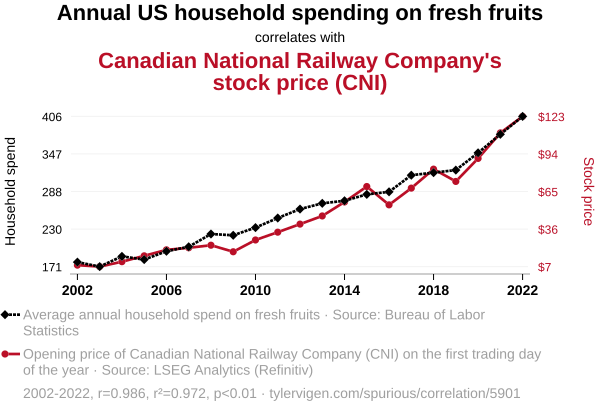
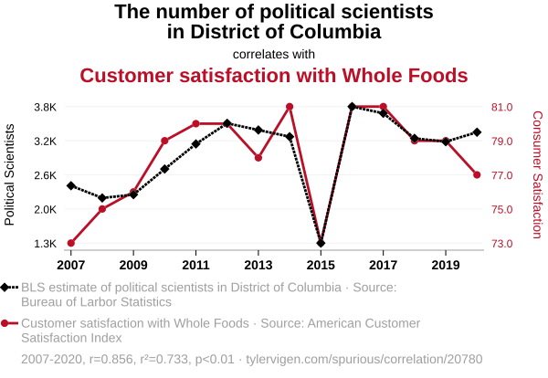

```{r}
#| include: false
pacman::p_load(tidyverse,
               ggdag, 
               dagitty)
```



# **1** 相関と因果

## 因果関係

因果関係：[原**因**（X）と結**果**（Y）の関係]{.alert}

- XがYを引き起こした
   - 例）$\bigcirc \bigcirc$の当選（X）が戦争（Y）を引き起こした
- Xが増えたから、Yも増えた
   - 例）食事量（X）を増やしたから、体重（Y）も増えた
- Xが小さくなったから、Yは大きくなった
   - 例）金利（X）が下がったから、株価（Y）が上がった
- Xが高くなったから、Yは少なくなった
   - 例）ストレス（X）が溜まったから、髪の毛（Y）が減った

## 果物消費量と鉄道会社の株価

**アメリカにおける1世帯当たりと年間果物消費量**と[**カナダ国鉄の株価**]{.alert}の関係

- $\rho$ = 0.986（$p$ < 0.001）

{fig-align="center"}

## 政治学者とスーパーマーケット

**ワシントンDC内の政治学者数**と[**Whole Foodsに対する顧客満足度**]{.alert}の関係

- $\rho$ = 0.856（$p$ < 0.001）

{fig-align="center"}

## 政策的含意

#### 果物消費量と鉄道会社の株価

- 例1：我が社（カナダ国鉄）の株価を上げたい
   - **解決策** $\Rightarrow$ アメリカ人に新鮮な果物を無料で提供する
- 例2：USの肥満率を下げるために、国民に果物をよりたくさん摂取してもらいたい
   - **解決策** $\Rightarrow$ カナダ国鉄の株を爆買いする

#### 政治学者とスーパーマーケット

- 例：我が社（Whole Foods）に対する顧客満足度を高めたい
   - **解決策** $\Rightarrow$ 政治学者をDCに送り込む

<br/>

<center>[**本当にこれで良いのか**]{.alert}<center>

## 様々な可能性

XがYの間に相関関係が存在する場合、XとYの間には因果関係が存在するのか

```{r}
#| layout-ncol: 3
#| layout-nrow: 2
#| fig-width: 3
#| fig-height: 1
#| fig-cap:
#|   - "XがYの原因"
#|   - "YがXの原因"
#|   - "XとYが互いに影響し合う（互恵関係）"

dagify(Y ~ X,
       coords = list(x = c(X = 0, Y = 2),
                     y = c(X = 0, Y = 0))) |> 
  ggdag(text_size = 8) + 
  coord_cartesian(xlim = c(-0.15, 2.15), ylim = c(-0.15, 0.15)) +
  theme_dag() + 
  theme(
    panel.background      = element_rect(fill = 'transparent', color = NA),
    plot.background       = element_rect(fill = 'transparent', color = NA),
  )

dagify(X ~ Y,
       coords = list(x = c(X = 0, Y = 2),
                     y = c(X = 0, Y = 0))) |> 
  ggdag(text_size = 8) +
  coord_cartesian(xlim = c(-0.15, 2.15), ylim = c(-0.15, 0.15)) +
  theme_dag() + 
  theme(
    panel.background      = element_rect(fill = 'transparent', color = NA),
    plot.background       = element_rect(fill = 'transparent', color = NA),
  )

dagify(Y ~ X,
       X ~ Y,
       coords = list(x = c(X = 0, Y = 2),
                     y = c(X = 0, Y = 0))) |> 
  ggdag(text_size = 8) +
  coord_cartesian(xlim = c(-0.15, 2.15), ylim = c(-0.15, 0.15)) +
  theme_dag() + 
  theme(
    panel.background      = element_rect(fill = 'transparent', color = NA),
    plot.background       = element_rect(fill = 'transparent', color = NA),
  )
```

```{r}
#| layout-ncol: 3
#| layout-nrow: 2
#| fig-width: 3
#| fig-height: 2.5
#| fig-cap:
#|   - "XがYの原因（Zを経由）"
#|   - "XがYは無関係（共通要因からの影響）"
#|   - "XがYは無関係（たまたまの相関）"

dagify(Y ~ Z,
       Z ~ X,
       coords = list(x = c(X = 0, Y = 2, Z = 1),
                     y = c(X = 0, Y = 0, Z = 1))) |> 
  ggdag(text_size = 8) +
  coord_cartesian(xlim = c(-0.15, 2.15), ylim = c(-0.15, 1.15)) +
  theme_dag() + 
  theme(
    panel.background      = element_rect(fill = 'transparent', color = NA),
    plot.background       = element_rect(fill = 'transparent', color = NA),
  )

dagify(Y ~ Z,
       X ~ Z,
       coords = list(x = c(X = 0, Y = 2, Z = 1),
                     y = c(X = 0, Y = 0, Z = 1))) |> 
  ggdag(text_size = 8) +
  coord_cartesian(xlim = c(-0.15, 2.15), ylim = c(-0.15, 1.15)) +
  theme_dag() + 
  theme(
    panel.background      = element_rect(fill = 'transparent', color = NA),
    plot.background       = element_rect(fill = 'transparent', color = NA),
  )

dagify(Y ~ 1,
       X ~ 1,
       coords = list(x = c(X = 0, Y = 2, Z = 1),
                     y = c(X = 0, Y = 0, Z = 1))) |> 
  ggdag(text_size = 8) +
  coord_cartesian(xlim = c(-0.15, 2.15), ylim = c(-0.15, 1.15)) +
  theme_dag() + 
  theme(
    panel.background      = element_rect(fill = 'transparent', color = NA),
    plot.background       = element_rect(fill = 'transparent', color = NA),
  )
```

## 相関は因果の十分条件か

ゲームオタクほど身長が伸びる?

```{r}
#| include: false
set.seed(1986)
game_df_m <- tibble(game = rnorm(50, mean = 3, sd = 0.75),
                    height = rnorm(50, mean = 170, sd = 7))

game_df_f <- tibble(game = rnorm(50, mean = 1, sd = 0.75),
                    height = rnorm(50, mean = 159, sd = 7)) |> 
  mutate(game = abs(game))

game_df <- list("男性" = game_df_m,
                "女性" = game_df_f) |> 
  bind_rows(.id = "gender")
```

```{r}
#| fig-width: 7
#| fig-height: 5
game_df |> 
  ggplot(aes(x = game, y = height)) +
  geom_point(size = 3) +
  geom_smooth(method = "lm", se = FALSE, linewidth = 2) +
  coord_cartesian(xlim = c(0, 5)) +
  labs(x = "ゲームのプレイ時間（1日平均）",
       y = "身長（cm）")
```

## 相関は因果の十分条件か：No!

性別で[**条件付け**]{.alert}ると因果効果は確認されない

```{r}
#| fig-width: 7
#| fig-height: 5
game_df |> 
  ggplot(aes(x = game, y = height, color = gender)) +
  geom_point(size = 3) +
  geom_smooth(method = "lm", se = FALSE, linewidth = 2) +
  guides(color = guide_legend(position = "inside")) +
  coord_cartesian(xlim = c(0, 5)) +
  labs(x = "ゲームのプレイ時間（1日平均）",
       y = "身長（cm）", color = "") +
  theme(legend.position.inside = c(1, 1),
        legend.justification   = c(1, 0.65))
```

## 相関は因果の必要条件か

職業訓練を受けても年収は上がらない?

```{r}
#| fig-width: 7
#| fig-height: 5
set.seed(19861008)
tibble(inc_b = rep(c("低", "中", "高"), each = 20)) |> 
  rowwise() |> 
  mutate(month = case_when(inc_b == "低" ~ sample(15:24, 1, replace = TRUE),
                           inc_b == "中" ~ sample(5:20,  1, replace = TRUE),
                           inc_b == "高" ~ sample(1:10,   1, replace = TRUE))) |> 
  mutate(inc_a = case_when(inc_b == "低" ~ 200 + month * 10 + rnorm(1, 0, 50),
                           inc_b == "中" ~ 300 + month * 10 + rnorm(1, 0, 50),
                           inc_b == "高" ~ 400 + month * 10 + rnorm(1, 0, 50))) |> 
  mutate(inc_b = fct_inorder(inc_b)) |> 
  ggplot(aes(x = month, y = inc_a)) +
  geom_point(size = 3) +
  geom_smooth(method = "lm", se = FALSE, linewidth = 2) +
  labs(x = "職業訓練の期間（ヶ月）", y = "訓練後の年収（万円）")
```

## 相関は因果の必要条件か：No!

訓練前の年収で[**条件付け**]{.alert}ると正の効果が確認できる

```{r}
#| fig-width: 7
#| fig-height: 5
set.seed(19861008)
tibble(inc_b = rep(c("低", "中", "高"), each = 20)) |> 
  rowwise() |> 
  mutate(month = case_when(inc_b == "低" ~ sample(15:24, 1, replace = TRUE),
                           inc_b == "中" ~ sample(5:20,  1, replace = TRUE),
                           inc_b == "高" ~ sample(1:10,   1, replace = TRUE))) |> 
  mutate(inc_a = case_when(inc_b == "低" ~ 200 + month * 10 + rnorm(1, 0, 50),
                           inc_b == "中" ~ 300 + month * 10 + rnorm(1, 0, 50),
                           inc_b == "高" ~ 400 + month * 10 + rnorm(1, 0, 50))) |> 
  mutate(inc_b = fct_inorder(inc_b)) |> 
  ggplot(aes(x = month, y = inc_a, color = inc_b)) +
  geom_point(size = 3) +
  geom_smooth(method = "lm", se = FALSE, linewidth = 2) +
  guides(color = guide_legend(position = "inside")) +
  labs(x = "職業訓練の期間（ヶ月）", y = "訓練後の年収（万円）",
       color = "訓練前の年収") +
  theme(legend.position.inside = c(1, 1),
        legend.justification   = c(1, 1))
```

## 相関関係と因果関係

相関は因果の必要条件でも、十分条件でも、必要十分条件でもない

- **信頼できる因果推論のためには適切な[条件付け]{.alert}に基づく[比較]{.alert}が不可欠**
- [**条件付け**]{.alert}[（conditioning）]{.small} / [**統制**]{.alert}[（control）]{.small} <!-- 回帰分析等の多変量解析では統制とも呼ばれる-->
   - 特定の変数の値が一致するケースに限定すること
   - 例）**男性（女性）における**ゲームプレイ時間と身長の関係

> *"Conditioning is the soul of statistics"*[（[Blitzstein and Hwang 2019](https://amzn.asia/d/ch0qXO7), p.46）]{.small}

- 因果推論のための比較の方法
   - A：1日ゲームプレイ時間が0分の男性の身長
   - B：1日ゲームプレイ時間が300分の男性の身長
   - AとBを[**比較する = 因果推論?**]{.alert} $\leftarrow$ Yes! But, ...

<!-- もしかしたら、ゲームしない子は健康志向で、残りの時間を運動に使っているかも -->
<!-- もしかしたら、ゲームしない子は家が貧しくてゲームができず、栄養状態が悪いかも知れない -->

# **2** 比較と因果推論

## 因果推論スキルと年収

問い：[因果推論スキル]{.alert}を身につければ[年収]{.alert}が上がるか

- 原因：因果推論スキルの有無
   - 例）宋さんの授業を履修したかどうか
- 結果：年収
  - 例）卒業3年後の年収

## 宋に任せてください

宋さんの授業を履修すれば年収は上がるか

:::: {.columns}
::: {.column width=40%}
```{r}
#| fig-width: 4
#| fig-height: 4
#| classes: nostretch
tibble(x = c("履修した\n(Aさん)", "履修しなかった\n(Bさん)"),
       y = c(358 + 150, 358)) |> 
  ggplot(aes(x = x, y = y)) +
  geom_col(color = "black", fill = "gray80") +
  annotate("col", x = "履修した\n(Aさん)", y = 358,
           fill = "gray80", color = "black", linetype = "dashed") +
  annotate("col", x = "履修した\n(Aさん)", y = 358 + 150,
           fill = "transparent", color = "black") +
  annotate("segment", 
           x = "履修した\n(Aさん)", xend = "履修した\n(Aさん)",
           y = 358, yend = 358 + 150,
           arrow = arrow(type = "closed"), linewidth = 1) +
  geom_text(aes(y = 0, label = y), color = "black", vjust = -0.25, size = 7) +
  coord_cartesian(ylim = c(0, 600)) +
  labs(x = "宋さんの授業を", y = "卒業3年後の年収（万円）")
```
:::

::: {.column width=60%}
- 宋さんの授業を履修したAと履修しなかったBの比較
   - 508 - 358 = 150
   - 宋さんの授業には150万円の価値がある?
   - $\Rightarrow$ 宋さんの給与を2倍にすべき
   - $\Rightarrow$ 宋さんにノーベル賞を授与すべき
:::
::::

:::: {.aside}
[※ 個人の感想であり効果・効能を保証するものではありません。]{.center}
::::

## 本当に任せても良いのか

宋さんの授業を履修すれば年収は上がるか

:::: {.columns}
::: {.column width=40%}
```{r}
#| fig-width: 4
#| fig-height: 4
tibble(x = c("履修した\n(Aさん)", "履修しなかった\n(Cさん)"),
       y = c(358 + 150, 358 + 250)) |> 
  ggplot(aes(x = x, y = y)) +
  geom_col(color = "black", fill = "gray80") +
  annotate("col", x = "履修した\n(Aさん)", y = 358 + 250,
           fill = "transparent", color = "black", linetype = "dashed") +
  annotate("col", x = "履修した\n(Aさん)", y = 358 + 150,
           fill = "transparent", color = "black") +
  annotate("segment", 
           x = "履修した\n(Aさん)", xend = "履修した\n(Aさん)",
           y = 358 + 250, yend = 358 + 150,
           arrow = arrow(type = "closed"), linewidth = 1) +
  geom_text(aes(y = 0, label = y), color = "black", vjust = -0.25, size = 7) +
  coord_cartesian(ylim = c(0, 600)) +
  labs(x = "宋さんの授業を", y = "卒業3年後の年収（万円）")
```
:::

::: {.column width=60%}
- 宋さんの授業を履修したAと履修しなかったCの比較
   - 508 - 608 = -100
   - 宋さんの授業は邪悪な授業?
   - $\Rightarrow$ これから頑張ってもらうために、宋さんの給与を2倍にすべき
   - $\Rightarrow$ これから頑張ってもらうために、宋さんにノーベル賞を授与すべき
:::
::::

:::: {.aside}
- 宋さんは悪くない
::::

## 何と何を比較するか

比較対象によって因果効果の推定値が異なる

:::: {.columns}
::: {.column width=50%}
```{r}
#| fig-width: 5
#| fig-height: 4
tibble(x = c("履修した\n(Aさん)", "履修しなかった\n(Bさん)", "履修しなかった\n(Cさん)"),
       y = c(358 + 150, 358, 358 + 250)) |> 
  ggplot(aes(x = x, y = y)) +
  geom_col(color = "black", fill = "gray80") +
  annotate("col", x = "履修した\n(Aさん)", y = 358 + 250,
           fill = "transparent", color = "black", linetype = "dashed") +
  annotate("col", x = "履修した\n(Aさん)", y = 358 + 150,
           fill = "transparent", color = "black") +
  annotate("segment", 
           x = "履修した\n(Aさん)", xend = "履修した\n(Aさん)",
           y = 358 + 250, yend = 358 + 150,
           arrow = arrow(type = "closed"), linewidth = 1) +
  annotate("col", x = "履修した\n(Aさん)", y = 358,
           fill = "gray80", color = "black", linetype = "dashed") +
  annotate("col", x = "履修した\n(Aさん)", y = 358 + 150,
           fill = "transparent", color = "black") +
  annotate("segment", 
           x = "履修した\n(Aさん)", xend = "履修した\n(Aさん)",
           y = 358, yend = 358 + 150,
           arrow = arrow(type = "closed"), linewidth = 1) +
  geom_text(aes(y = 0, label = y), color = "black", vjust = -0.25, size = 7) +
  coord_cartesian(ylim = c(0, 600)) +
  labs(x = "宋さんの授業を", y = "卒業3年後の年収（万円）")
```
:::

::: {.column width=50%}
どの比較が適切か[^compare-3]

|比較|因果効果の推定値|
|:---|---:|
|A vs. B|150万円^[多分、この結果が正しい]|
|A vs. C|-100万円^[こんなはずがない]|

- 平均を取って25万円?

:::
::::

## なぜAさんは宋さんの授業を履修したか

なぜAさんは宋さんの授業を履修しようと思ったのか

- 理由1：宋さんのファンだから
- 理由2：宋さんがイケメンだから目の保養のために
- 理由3：[**この授業を履修すると年収が上がると思ったから**]{.alert}
- 理由4：この授業を履修するように指導教員に脅迫されたから
- 理由5：気になる子が履修しているから
- 理由6：ノーベル因果推論賞を狙っているから
- 理由7：因果推論分からんやつにマウント取りたりから

<br/>

- $\Rightarrow$ すべて正しいと思われるが[^reason]、ここでは年収に関連する理由3に注目

[^reason]: ただし、理由4を除く

## Aさんの意思決定

理由3：この授業を履修すると年収が上がると思ったから

- 宋さんの授業を履修したら...
   - [宋さんの授業を履修しなかった場合に比べ、年収が上がるはず!]{.alert}
- 宋さんの授業を履修しなかったら...
   - 宋さんの授業を履修した場合に比べ、年収が下がるはず!

<br/>

- Aさんは「履修をした場合の自分」と「履修をしなかった場合の自分」を比較し、履修を決定
  - $\Rightarrow$ Aさんはすでに履修してしまったので、Aさんの適切な比較対象は「[**履修をしなかった場合のAさん**]{.alert}」

## 例）啓発活動と投票率

啓発活動は投票率を上げるか

:::: {.columns}
::: {.column width=40%}
```{r}
#| fig-width: 4
#| fig-height: 4
tibble(Campaign = c("なし（A市）", "あり（B市）"),
       Turnout  = c(60, 50)) |>
  mutate(Campaign = fct_inorder(Campaign)) |>
  ggplot(aes(x = Campaign, y = Turnout)) +
  geom_col(color = "black", fill = "gray80") +
  geom_text(aes(y = 0, label = Turnout), size = 8, vjust = -0.25) +
  labs(x = "啓発活動", y = "投票率（%）") +
  coord_cartesian(ylim = c(0, 100))
```
:::

::: {.column width=60%}
- 啓発活動によって投票率が10%p$\downarrow$?
- B市の適切な比較対象は?
   - A市?
   - [啓発活動をしなかった場合のB市]{.alert}?
:::
::::

## B市の意思決定

なぜB市は予算を使ってまで啓発活動をしようと思ったのか

- 理由1：啓発活動をすれば投票率が上がると思ったから
- 理由2：元々の投票率が低すぎて何かしようと思ったから
- $\Rightarrow$ 啓発活動をしたら[何もしなかった場合に比べ、投票率が上がるはず!]{.alert}

<br/>

- B市は「啓発活動をした場合のB市」と「啓発活動をしなかった場合のB市」を比較し、啓発活動の実施有無を決定
  - $\Rightarrow$ B市の適切な比較対象は「[**啓発活動をしなかった場合のB市**]{.alert}」

## 例）ゲームのプレイ時間と身長

因果推論における理想の比較対象は「[**もし$\bigcirc \bigcirc$したら/しなかったら...**]{.alert}」

:::: {.columns}
::: {.column width=40%}
```{r}
#| fig-width: 4
#| fig-height: 4
tibble(Time   = c("0分\n（宋の弟）", "3時間\n（宋）"),
       Height = c(185, 176)) |>
  mutate(Time = fct_inorder(Time)) |>
  ggplot(aes(x = Time, y = Height)) +
  geom_col(color = "black", fill = "gray80") +
  geom_text(aes(y = 0, label = Height), size = 8, vjust = -0.25) +
  labs(x = "1日当りゲームプレイ時間", y = "身長（cm）") +
  coord_cartesian(ylim = c(0, 200))
```
:::

::: {.column width=60%}
- 1日のゲームプレイ時間が3時間伸びると身長が9cm縮む?
- 宋の弟は宋の適切な比較対象か
   - 幼少期の親の経済力
   - 健康志向の程度
   - ...
- 宋の適切な比較対象は「ゲームを全くプレイしない宋[^song]」
:::
::::

[^song]: 宋の弟も宋だが、ここでの宋はあなたが知っているその宋だ。

# **3** 潜在的結果枠組み

## 潜在的結果枠組み[（Potential outcome framework）]{.small}

因果効果を[潜在的結果間の差分]{.strong}として捉える考え方

- 2種類の潜在的結果
   - [事実]{.strong}[（factual）]{.small}
   - [反事実]{.strong}[（counterfactual）]{.small}
- 因果効果 = 事実と反事実の差分

## 表記法

- $i$：個体の固有番号（1, 2, 3, ..., $n$）
- $D_i$：個体$i$の処置有無（0、または1）
   - 処置を受けた個体の集合を[処置群]{.strong}[^treatment][（treatment group）]{.small}、受けなかった個体の集合を[統制群]{.strong}[^control][（control group）]{.small}と呼ぶ
- $Y_i$：個体$i$の結果変数（応答変数）
   - $Y_i(D_i = 1) = Y_i(1)$：個体$i$が処置を受けた場合の結果変数
   - $Y_i(D_i = 0) = Y_i(0)$：個体$i$が処置を受けなかった場合の結果変数

[^treatment]: 「処置」は介入、刺激、曝露（exposure）などとも呼ばれる。
[^control]: 対照群とも呼ばれる。

## 潜在的結果[（potential outcome）]{.small}

特定の固定が処置を受けた/受けなかった場合の結果変数の値

- $D_i = 0$の場合：$Y_i (0)$は[事実]{.hl_blue}、$Y_i (1)$が[反事実]{.hl_red}
- $D_i = 1$の場合：$Y_i (0)$が[反事実]{.hl_red}、$Y_i (1)$は[事実]{.hl_blue}

|$i$|$D_i$|$Y_i(0)$|$Y_i(1)$|
|---:|---:|---:|---:|
|1|0|[344]{.hl_blue}|[444]{.hl_red}|
|2|0|[455]{.hl_blue}|[505]{.hl_red}|
|3|0|[479]{.hl_blue}|[379]{.hl_red}|
|4|1|[404]{.hl_red}|[554]{.hl_blue}|
|5|1|[295]{.hl_red}|[395]{.hl_blue}|
|6|1|[298]{.hl_red}|[248]{.hl_blue}|

## 因果効果の定義

[個体レベルにおける処置効果]{.alert}（individual treatment effect; [ITE]{.strong}）

- 全く同じ時点、かつ同じ個体における$Y_i(1)$と$Y_i(0)$の差分

$$
\textsf{ITE}_i = Y_i (1) - Y_i (0) 
$$

|$i$|$D_i$|$Y_i(0)$|$Y_i(1)$|$\textsf{ITE}_i$|
|---:|---:|---:|---:|---:|
|1|0|344|444|100|
|2|0|455|505|50|
|3|0|479|379|-100|
|4|1|404|554|150|
|5|1|295|395|100|
|6|1|248|248|0|

## 平均処置効果

[平均処置効果]{.alert}（average treatment effect; [ATE]{.strong}）：[ITE]{.hl_blue}の平均

$$
\textsf{ATE} = \frac{1}{n} \sum_i^n \bigl( \textcolor{royalblue}{Y_i (1) - Y_i (0)} \bigr) = \mathbb{E}[Y_i(1)] - \mathbb{E}[Y_i(0)]
$$

|$i$|$D_i$|$Y_i(0)$|$Y_i(1)$|$\textsf{ITE}_i$|
|---:|---:|------:|------:|------:|
|1|0|344|444|$\textsf{ITE}_1$ = &nbsp;[100]{.hl_red}|
|2|0|455|505|$\textsf{ITE}_2$ = &nbsp;&nbsp;&nbsp;[50]{.hl_red}|
|3|0|479|379|$\textsf{ITE}_3$ = [-100]{.hl_red}|
|4|1|404|554|$\textsf{ITE}_4$ = &nbsp;[150]{.hl_red}|
|5|1|295|395|$\textsf{ITE}_5$ = &nbsp;[100]{.hl_red}|
|6|1|248|248|$\textsf{ITE}_6$ = &nbsp;&nbsp;&nbsp;&nbsp;&nbsp;[0]{.hl_red}|
|平均||370.8|420.8|[50]{.strong}|

## 平均処置効果

[平均処置効果]{.alert}（average treatment effect; [ATE]{.strong}）：[$Y_i(1)$の平均値 - $Y_i(0)$の平均値]{.hl_blue}

$$
\textsf{ATE} = \frac{1}{n} \sum_i^n \bigl( Y_i (1) - Y_i (0) \bigr) = \textcolor{royalblue}{\mathbb{E}[Y_i(1)] - \mathbb{E}[Y_i(0)]}
$$

|$i$|$D_i$|$Y_i(0)$|$Y_i(1)$|$\textsf{ITE}_i$|
|---:|---:|------:|------:|------:|
|1|0|344|444|100|
|2|0|455|505|50|
|3|0|479|379|-100|
|4|1|404|554|150|
|5|1|295|395|100|
|6|1|248|248|0|
|平均||$\mathbb{E}[Y_i(0)]$ = [370.8]{.hl_red}|$\mathbb{E}[Y_i(1)]$ = [420.8]{.hl_red}|[50]{.strong}|

## 因果推論の根本問題[（fundamental problem of causal inference）]{.small}

反事実は観察できないため、ITEの推定は不可能

- $\leadsto$ [ITEの平均値としてのATE]{.alert}は推定**不可能**

|$i$|$D_i$|$Y_i(0)$|$Y_i(1)$|$\textsf{ITE}_i$|
|---:|---:|---:|---:|---:|
|1|0|344||[?]{.strong}|
|2|0|455||[?]{.strong}|
|3|0|479||[?]{.strong}|
|4|1||554|[?]{.strong}|
|5|1||395|[?]{.strong}|
|6|1||248|[?]{.strong}|
|平均||||[?]{.strong}|

## 因果推論の根本問題と事実・反事実

- $Y_i(0 | D_i = 0)$：統制群の個体$i$が処置を受けなかった場合の$Y_i$ $\rightarrow$ 事実
   - 統制群における$Y_i(0)$は観察可能 $\leadsto$ $\mathbb{E}[Y_i(0 | D_i = 0)]$も計算可能
- $Y_i(0 | D_i = 1)$：処置群の個体$i$が処置を受けなかった場合の$Y_i$ $\rightarrow$ 反事実
   - 処置群における$Y_i(0)$は観察不可能 $\leadsto$ $\mathbb{E}[Y_i(0 | D_i = 1)]$も計算**不**可能
- $Y_i(1 | D_i = 0)$：統制群の個体$i$が処置を受けた場合の$Y_i$ $\rightarrow$ 反事実
   - 統制群における$Y_i(1)$は観察不可能 $\leadsto$ $\mathbb{E}[Y_i(1 | D_i = 0)]$も計算**不**可能
- $Y_i(1 | D_i = 1)$：処置群の個体$i$が処置を受けた場合の$Y_i$ $\rightarrow$ 事実
   - 処置群における$Y_i(1)$は観察可能 $\leadsto$ $\mathbb{E}[Y_i(1 | D_i = 1)]$も計算可能

## 因果推論の根本問題とATE

[観測値の平均値の差分としてATE]{.alert}は推定**可能** 

- $\mathbb{E}[Y_i(1)] - \mathbb{E}[Y_i(0)]$でなく、$\mathbb{E}[Y_i(1 | D_i = 1)] - \mathbb{E}[Y_i(0 | D_i = 0)]$は計算可能
   - これは信頼可能なATEか $\Rightarrow$ 

|$i$|$D_i$|$Y_i(0)$|$Y_i(1)$|$\textsf{ITE}_i$|
|---:|---:|------:|------:|---:|
|1|0|344||[?]{.strong}|
|2|0|455||[?]{.strong}|
|3|0|479||[?]{.strong}|
|4|1||554|[?]{.strong}|
|5|1||395|[?]{.strong}|
|6|1||248|[?]{.strong}|
|平均||$\mathbb{E}[Y_i(0 | D_i = 0)]$ = 426|$\mathbb{E}[Y_i(1 | D_i = 1)]$ = 399|[-27]{.strong}|

## 参考：ATT

統計的因果推論ではATTが推定対象となるケースも多い^[詳細は割愛するが、今後必要に応じて適宜解説する。]

- [**ATT**]{.alert}[（Average Treatment Effect **on the Treated**; 処置群におけるATE）]{.small}
   - $\mathbb{E}[Y_i(1) | D_i = 1] - \mathbb{E}[Y_i(0) | D_i = 1] = \mathbb{E}[Y_i(1) - Y_i(0) | D_i = 1]$
- ATEはATTとATCの加重平均

: ATTの例

|$i$|$D_i$|$Y_i(0)$|$Y_i(1)$|$\textsf{ITE}_i$|
|---:|---:|---:|---:|---:|
|4|1|404|554|150|
|5|1|295|395|100|
|6|1|248|248|0|
|平均||||[**83.3**]{.alert}|

## 参考：ATC

統計的因果推論ではATTが推定対象となるケースも多い^[詳細は割愛するが、今後、必要に応じて適宜解説する。]

- [**ATC**]{.alert}[（Average Treatment Effect **on the Controlled**; 統制群におけるATE）]{.small}
   - $\mathbb{E}[Y_i(1) | D_i = 0] - \mathbb{E}[Y_i(0) | D_i = 0] = \mathbb{E}[Y_i(1) - Y_i(0) | D_i = 0]$
- ATEはATTとATCの加重平均

: ATCの例

|$i$|$D_i$|$Y_i(0)$|$Y_i(1)$|$\textsf{ITE}_i$|
|---:|---:|---:|---:|---:|
|1|0|344|444|100|
|2|0|455|505|50|
|3|0|479|379|-100|
|平均||||[**16.7**]{.alert}|

## 信頼できるATEの条件

私たちが本当に知りたいのはITE[^ite-ate]

- <i class="bi bi-emoji-tear"></i> 因果推論の根本問題により、ITEは推定不可能
- <i class="bi bi-emoji-neutral"></i> 観測値の平均値の差分としてのATEは推定可能
   - ただし、この推定値が信頼できるATEとは限らない
- どのような場合、観測値の平均値の差分は信頼できるATEになるか
   - $\Rightarrow$ [内生性が存在しない]{.strong}こと <br/> $=$ [処置変数が外生変数]{.strong}であること <br/> $=$ 処置群と統制群が[交換可能]{.strong}、または[（平均）独立]{.strong}であること

<br/>

<center>[内生性/外生性とは?交換可能?独立?]{.strong}</center>

[^ite-ate]: ITEよりATEに興味があるかも知れないが、それでもITEの方が望ましいだろう。なぜならITEからATEは推定可能なものの、その逆は成立しないからだ。
