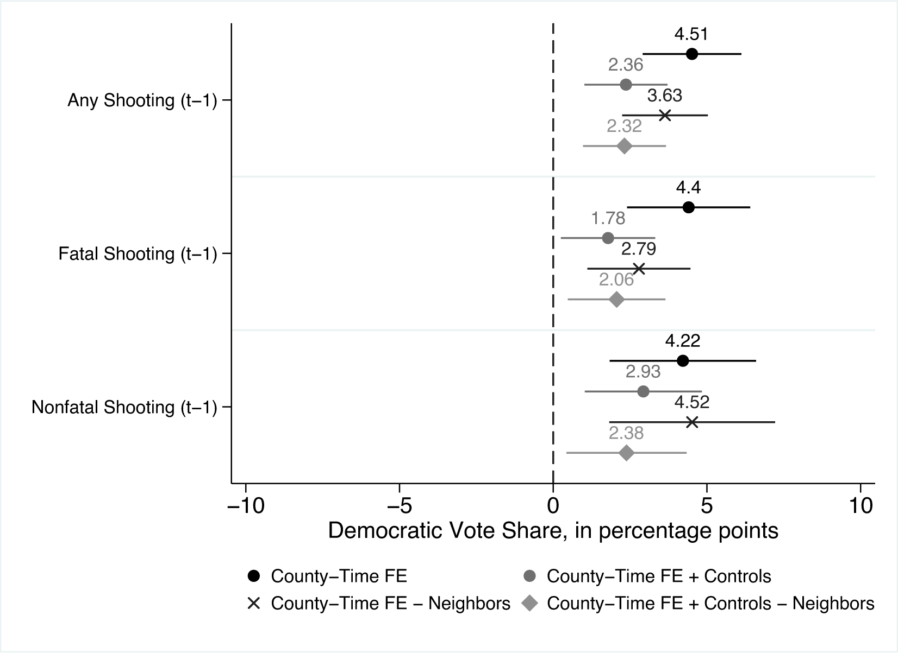

```{r}
#| include: false
pacman::p_load(tidyverse, 
               broom,
               haven,
               fastDummies,
               summarytools,
               modelsummary,
               gt,
               gtExtras,
               ggdag,
               dagitty,
               estimatr,
               panelView,
               fect,
               fixest,
               gsynth,
               latex2exp)

eVote   <- read_csv("_data_slide/did/eVote_kyoto.csv")
germany <- read_dta("_data_slide/did/repgermany.dta")

germany <- germany |> 
  mutate(country2 = as_factor(country),
         treat    = if_else(country2 == "West Germany" & year >= 1990, 1, 0))
```



# **1** 差分の差分法

## 電子投票の導入と投票率

2004年京都市長選挙における電子投票の導入[^first-evote]

- 11の行政区の内、東山区[**のみ**]{.alert}導入
- タッチパネル式投票（投票所に足を運ぶ必要はある）

::: {layout-ncol=2}
{fig-align="center"}

{fig-align="center"}
:::

[^first-evote]: 日本における電子投票の初導入事例は2002年の岡山県新見市（首長・市議会選挙）

## 東山区の投票率（経時的変化）

- 電子投票導入後、投票率が約2.1%p減少（45.6% $\rightarrow$ 43.5%）
   - 電子投票は投票率を下げる?

```{r}
#| fig-width: 6
#| fig-height: 3.5
eVote |> 
  #filter(Ward_E %in% c("Higashiyama", "Sakyo")) |> 
  filter(Ward_E %in% c("Higashiyama")) |> 
  filter(year %in% c(2000, 2004)) |> 
  mutate(Ward_J = str_c(Ward_J, "の投票率"),
         Ward_J = fct_relevel(Ward_J, "東山区の投票率")) |> 
  ggplot(aes(x = trend, y = turnout, color = Ward_J)) +
  geom_line(linewidth = 1) +
  labs(x = "年", y = "投票率", color = "") +
  guides(color = guide_legend(position = "inside")) +
  scale_x_continuous(breaks = 4:5,
                     labels = c(2000, 2004)) +
  coord_cartesian(ylim = c(0.35, 0.5)) +
  theme(legend.position.inside = c(0.8, 1))
```

## 内生性

```{r}
#| fig-width: 4
#| fig-height: 4
dagify(Y ~ D + e,
       D ~ e,
       exposure = "D",
       outcome  = "Y",
       coords = list(x = c(Y = 2, D = 0, e = 1),
                     y = c(Y = 0, D = 0, e = 2))) |> 
  tidy_dagitty() |> 
  mutate(xend = if_else(xend == 2 & y == 0, xend - 0.05, xend),
         yend = if_else(y == 0 & yend == 0, yend - 0.15, yend),
         y    = if_else(y == 0, y - 0.15, y)) |> 
  mutate(error = if_else(name == "e", "error", "observed"),
         name  = recode(name,
                        "e" = "誤差\n(その他の要因)",
                        "D" = "電子投票",
                        "Y" = "投票率")) |>
  ggplot(aes(x = x, y = y, xend = xend, yend = yend)) +
  annotate("point", x = 1 - 0.25, y = 2, shape = 15, size = 20) +
  annotate("point", x = 1 + 0.25, y = 2, shape = 15, size = 20) +
  geom_dag_point(aes(size = error, shape = error)) +
  geom_dag_edges(edge_width = 1.5) +
  geom_dag_text(col = "white") +
  guides(shape = "none", size = "none") +
  scale_size_manual(values = c("observed" = 25, "error" = 20)) +
  scale_shape_manual(values = c("observed" = 19, "error" = 15)) +
  coord_cartesian(xlim = c(-0.15, 2.15), ylim = c(-0.35, 2.15)) +
  theme_dag() + 
  theme(
    panel.background      = element_rect(fill = 'transparent', color = NA),
    plot.background       = element_rect(fill = 'transparent', color = NA),
  )
```

- 電子投票の導入は選管が決めるため、自己選択バイアスの可能性がある。
- $\Rightarrow$ 電子投票と投票率間の交絡要因は?
   - どのような場合に選管は電子投票の導入を検討するか。

## 自己選択バイアスの例（1）

```{r}
#| fig-width: 4
#| fig-height: 4
dagify(Y ~ D + e,
       D ~ e,
       exposure = "D",
       outcome  = "Y",
       coords = list(x = c(Y = 2, D = 0, e = 1),
                     y = c(Y = 0, D = 0, e = 2))) |> 
  tidy_dagitty() |> 
  mutate(xend = if_else(xend == 2 & y == 0, xend - 0.05, xend),
         yend = if_else(y == 0 & yend == 0, yend - 0.15, yend),
         y    = if_else(y == 0, y - 0.15, y)) |> 
  mutate(error = if_else(name == "e", "error", "observed"),
         name  = recode(name,
                        "e" = "低投票率",
                        "D" = "電子投票",
                        "Y" = "投票率")) |>
  ggplot(aes(x = x, y = y, xend = xend, yend = yend)) +
  geom_dag_point(aes(size = error, shape = error)) +
  geom_dag_edges(edge_width = 1.5) +
  geom_dag_text(col = "white") +
  annotate("point", x = 0.5, y = 1, shape = 15, size = 25) +
  annotate("text", x = 0.5, y = 1, label = "危機意識", 
           color = "white", fontface = "bold") +
  guides(shape = "none", size = "none") +
  scale_size_manual(values = c("observed" = 25, "error" = 25)) +
  scale_shape_manual(values = c("observed" = 19, "error" = 15)) +
  coord_cartesian(xlim = c(-0.15, 2.15), ylim = c(-0.35, 2.15)) +
  theme_dag() + 
  theme(
    panel.background      = element_rect(fill = 'transparent', color = NA),
    plot.background       = element_rect(fill = 'transparent', color = NA),
  )
```

- 東山区の投票率は元々低く、選管が投票率向上のために電子投票を導入
- 元々投票率の低い地域は次の選挙の投票率も低い傾向
- 電子投票のおかげで2.1%p減で食い止められたかも
- $\Rightarrow$ 単純前後比較には限界があり、[**比較対象が必要**]{.alert}

## 東山区の投票率（群間比較）

- 電子投票を導入した東山区の投票率は導入しなかった区に比べ、約4.5%p高い
   - 電子投票は投票率を上げる?

```{r}
#| fig-width: 7
#| fig-height: 3.5
eVote |> 
  filter(year == 2004) |> 
  arrange(desc(turnout)) |> 
  mutate(Ward_J = str_remove(Ward_J, "区"),
         Ward_J = fct_inorder(Ward_J),
         eVote  = factor(eVote),
         turnout = turnout * 100) |> 
  ggplot(aes(x = Ward_J)) +
  geom_col(aes(y = turnout, fill = eVote), color = "black") +
  geom_text(aes(y = 0, label = sprintf("%.1f", turnout)), 
            color = "white", vjust = -0.5) +
  geom_hline(yintercept = 39.0, linewidth = 1, color = "tomato") +
  annotate("label", x = "伏見", y = 39.0, 
           label = "東山区を除く平均値：39.0",
           hjust = 0.9, vjust = -0.15) +
  labs(x = "区", y = "投票率（%）", caption = "注：今後の議論を単純化するために上京区はデータから除外した。") +
  scale_fill_manual(values = c("0" = "gray70", "1" = "gray30")) +
  theme(legend.position = "none")
```

## 自己選択バイアスの例（2）

```{r}
#| fig-width: 4
#| fig-height: 4
dagify(Y ~ D + e,
       D ~ e,
       exposure = "D",
       outcome  = "Y",
       coords = list(x = c(Y = 2, D = 0, e = 1),
                     y = c(Y = 0, D = 0, e = 2))) |> 
  tidy_dagitty() |> 
  mutate(xend = if_else(xend == 2 & y == 0, xend - 0.05, xend),
         yend = if_else(y == 0 & yend == 0, yend - 0.15, yend),
         y    = if_else(y == 0, y - 0.15, y)) |> 
  mutate(error = if_else(name == "e", "error", "observed"),
         name  = recode(name,
                        "e" = "高い意識",
                        "D" = "電子投票",
                        "Y" = "投票率")) |>
  ggplot(aes(x = x, y = y, xend = xend, yend = yend)) +
  geom_dag_point(aes(size = error, shape = error)) +
  geom_dag_edges(edge_width = 1.5) +
  geom_dag_text(col = "white") +
  annotate("point", x = 1.5, y = 1, shape = 15, size = 25) +
  annotate("text", x = 1.5, y = 1, label = "高投票率", 
           color = "white", fontface = "bold") +
  guides(shape = "none", size = "none") +
  scale_size_manual(values = c("observed" = 25, "error" = 25)) +
  scale_shape_manual(values = c("observed" = 19, "error" = 15)) +
  coord_cartesian(xlim = c(-0.15, 2.15), ylim = c(-0.35, 2.15)) +
  theme_dag() + 
  theme(
    panel.background      = element_rect(fill = 'transparent', color = NA),
    plot.background       = element_rect(fill = 'transparent', color = NA),
  )
```

- 東山区の選管は投票参加の重要性を認識
   - $\Rightarrow$ 東山区は元々投票率が高かった可能性 & 更に投票率を上げるための方法を導入
- 電子投票がなくても東山区は投票率が高い可能性
- $\Rightarrow$ 単純群間比較には限界があり、[**比較対象が必要**]{.alert}

## 何と何を比較するか

「[**電子投票を導入しなかった2004年の東山区**]{.alert}」が最適な比較対象

- しかし、観察できない（[因果推論の根本問題]{.alert}）
- 郡間比較も、前後比較も、適切な比較方法ではない[（可能性が高い）]{.small}
- ある仮定が満たされれば、郡間比較、または前後比較で因果効果が推定可能
   - その仮定とは?

## 2つの推定方法（1）

||処置前（Pre）|処置後（Post）|
|:---:|:---:|:---:|
|統制（$D_i = 0$）|$\mathbb{E}[Y_{i, \textsf{pre}}^0|D_i = 0]$|$\mathbb{E}[Y_{i, \textsf{post}}^0|D_i = 0]$|
|処置（$D_i = 1$）|$\mathbb{E}[Y_{i, \textsf{pre}}^1|D_i = 1]$|$\mathbb{E}[Y_{i, \textsf{post}}^1|D_i = 1]$|

$$
\textsf{ATT} = \mathbb{E}[Y_{i, \textsf{post}}^1|D_i = 1] - \underbrace{\mathbb{E}[Y_{i, \textsf{pre}}^0|D_i = 1]}_{\scriptstyle \textsf{counterfactual}}
$$

#### **群間比較**（Cross-sectional design）

- $\mathbb{E}[Y_{i, \textsf{post}}^1|D_i = 1] - \mathbb{E}[Y_{i, \textsf{post}}^0|D_i = 0]$
- ATTが推定可能となる仮定：$\mathbb{E}[Y_{i, \textsf{post}}^0|D_i = 1] = \mathbb{E}[Y_{i, \textsf{post}}^0|D_i = 0]$

## 2つの推定方法（2）

||処置前（Pre）|処置後（Post）|
|:---:|:---:|:---:|
|統制（$D_i = 0$）|$\mathbb{E}[Y_{i, \textsf{pre}}^0|D_i = 0]$|$\mathbb{E}[Y_{i, \textsf{post}}^0|D_i = 0]$|
|処置（$D_i = 1$）|$\mathbb{E}[Y_{i, \textsf{pre}}^1|D_i = 1]$|$\mathbb{E}[Y_{i, \textsf{post}}^1|D_i = 1]$|

$$
\textsf{ATT} = \mathbb{E}[Y_{i, \textsf{post}}^1|D_i = 1] - \underbrace{\mathbb{E}[Y_{i, \textsf{pre}}^0|D_i = 1]}_{\scriptstyle \textsf{counterfactual}}
$$

#### **前後比較**（Before-and-after design）

- $\mathbb{E}[Y_{i, \textsf{post}}^1|D_i = 1] - \mathbb{E}[Y_{i, \textsf{pre}}^1|D_i = 1]$
- ATTが推定可能となる仮定：$\mathbb{E}[Y_{i, \textsf{post}}^0|D_i = 1] = \mathbb{E}[Y_{i, \textsf{pre}}^1|D_i = 1]$

## 前後 + 群間比較

- 同時期における北区の投票率は約8.3%p減少（48.7% $\rightarrow$ 40.4%）
   - 電子投票は投票率を下げる? $\rightarrow$ そうじゃないかも知れない。

```{r}
#| fig-width: 6
#| fig-height: 3.5
eVote |> 
  filter(Ward_E %in% c("Higashiyama", "Kita")) |> 
  filter(year %in% c(2000, 2004)) |> 
  mutate(Ward_J = str_c(Ward_J),
         Ward_J = fct_relevel(Ward_J, "東山区")) |> 
  ggplot(aes(x = trend, y = turnout, color = Ward_J)) +
  geom_line(linewidth = 1) +
  labs(x = "年", y = "投票率", color = "") +
  guides(color = guide_legend(position = "inside")) +
  scale_x_continuous(breaks = 4:5,
                     labels = c(2000, 2004)) +
  coord_cartesian(ylim = c(0.35, 0.5)) +
  theme(legend.margin = margin(0, 0, 0, 0), # turned off for alignment
        legend.justification.top = "left",
        legend.justification.left = "top",
        legend.justification.bottom = "right",
        legend.justification.inside = c(0.95, 0.95),
        legend.location = "plot",
        plot.title.position = "plot",
        legend.title = element_blank())
```

## 反事実を考える

2004年に東山区が電子投票を導入しなかったら...

- 北区同様、約8.3%p減少したかも知れない（[破線]{style="color:tomato;"}）。

:::: {.columns}
::: {.column width="50%"}
```{r}
#| fig-width: 4
#| fig-height: 3.5
eVote |> 
  filter(Ward_E %in% c("Higashiyama", "Kita")) |> 
  filter(year %in% c(2000, 2004)) |> 
  mutate(Ward_J = fct_relevel(Ward_J, "東山区")) |> 
  ggplot(aes(x = trend, y = turnout, color = Ward_J)) +
  geom_line(linewidth = 1) +
  annotate("segment", x = 4, xend = 5, y = 0.456, yend = 0.373,
           linewidth = 1, linetype = "dashed", color = "#F8766D") +
  annotate("segment", x = 5, xend = 5, y = 0.373, yend = 0.435,
           linewidth = 1, linetype = "solid", color = "firebrick",
           arrow = arrow(type = "closed", length = unit(0.15, "inches"))) +
  annotate("text", x = 5, y = 0.373 + 0.031, label = c("0.062"), hjust = 1.25) +
  labs(x = "年", y = "投票率", color = "行政区") +
  guides(color = guide_legend(position = "inside")) +
  scale_x_continuous(breaks = 4:5,
                     labels = c(2000, 2004)) +
  coord_cartesian(xlim = c(4, 5.05), ylim = c(0.35, 0.5)) +
  theme(legend.margin = margin(0, 0, 0, 0), # turned off for alignment
        legend.justification.top = "left",
        legend.justification.left = "top",
        legend.justification.bottom = "right",
        legend.justification.inside = c(0.95, 0.95),
        legend.location = "plot",
        plot.title.position = "plot",
        legend.title = element_blank())
```
:::

::: {.column width="50%"}
- 実際は約2.1%p減に留まった。
- $\Rightarrow$ 電子投票のおかげで投票率が[**6.2%p増**]{.alert}
:::
::::

## 電子投票の因果効果の推定

- 処置効果$\delta$は[**処置群における変化量**]{.alert}と[**統制群における変化量**]{.alert}の差分
   - $A$：処置群における差分 = 観測された処置群の変化量
   - $B$：統制群における差分 = もし処置群が処置を受けなかった場合の処置群の変化量の推定値（反事実）
   - $\delta_{\textsf{ATT}} = A - B$：因果効果・処置効果

$$
\begin{align}
\delta_{\textsf{ATT}} & = (Y_{\textsf{treat}, \textsf{pre}} - Y_{\textsf{treat}, \textsf{post}}) - (Y_{\textsf{control}, \textsf{pre}} - Y_{\textsf{control}, \textsf{post}}) \\
& = (0.435 - 0.456) - (0.404 - 0.487) \\
& = (-0.021) - (-0.083) \\
& = 0.062
\end{align}
$$

## 差分の差分法

[Difference-in-Differences]{.strong}（DD / DID / Diff-in-Diff / Dif-in-Dif）

- 処置群と統制群の変化の差を比較することで、因果効果を推定する準実験的手法
   - 主に[政策介入]{.strong}や[制度変更]{.strong}などの因果効果を推定する際に使用
- 時間を通じた結果変数の変化の差を、処置群と統制群の間で比較
   - 時系列データを使って対象の経時的変化のみを分析（$\times$）
   - ある時点における介入群と対照群の差異のみを分析（$\times$）
- 推定量はATEでなく、[ATT]{.strong}
- [パネルデータ]{.strong}（panel data）が必要

## パネルデータ

[同じ個体を複数回の観測]{.strong}したデータ

- 個体は主に国、地域、企業、団体などの集団が多い
   - DIDが主に政策介入、制度変更の因果効果に活用される理由
<!--   - 個体自ら観測結果を発信することが多いので、収集コストが非常に低い -->
   - 人間のパネルデータも構築可能（収集コストが高い）
- 以下は2つの個体（東山区と北区）を2回（2000年と2004年）観測したデータ
   - 観測単位は「区」でも、「年」でもなく、「区 $\times$ 年」

|区|年|投票方式|投票率|
|:---|---:|:---|---:|
|東山区|2000|自書|45.6|
|東山区|2004|電子|43.5|
|北区  |2000|自書|48.7|
|北区  |2004|自書|40.4|

## 参考）クロスセクションデータ

一つ一つの個体は1回のみ登場する

- すべての個体は同じタイミングで観測されており、観測回数は1回のみ
- $\Rightarrow$「個体1」が2回以上登場することはない

|個体|変数1|変数2|
|:---|---:|---:|
|個体1|7.1|54.0|
|個体2|8.1|49.5|
|個体3|5.0|55.4|
|個体4|6.1|48.8|
|個体5|7.3|55.6|
|個体6|6.5|47.5|
|個体7|3.8|48.6|

## パネルデータの例

個体が4つ（個体1〜4）、時期が2期（2023年、2024年）の場合

:::: {.columns}
:::{.column width=40%}
|個体|時期|変数1|変数2|
|:---|:---|---:|---:|
|個体1|[2023年]{.fg style="--col: #1955A6"}|1299|79|
|個体1|[2024年]{.fg style="--col: #B22222"}|1266|90|
|[個体2]{.fg style="--col: #B22222"}|[2023年]{.fg style="--col: #1955A6"}|1620|17|
|[個体2]{.fg style="--col: #B22222"}|[2024年]{.fg style="--col: #B22222"}|1653|15|
|[個体3]{.fg style="--col: #19A647"}|[2023年]{.fg style="--col: #1955A6"}|1551|23|
|[個体3]{.fg style="--col: #19A647"}|[2024年]{.fg style="--col: #B22222"}|1585|23|
|[個体4]{.fg style="--col: #1955A6"}|[2023年]{.fg style="--col: #1955A6"}|1024|154|
|[個体4]{.fg style="--col: #1955A6"}|[2024年]{.fg style="--col: #B22222"}|991|165|
:::

:::{.column width=60%}
- [個体2]{.fg style="--col: #B22222"}は2回登場する。
   - 個体2は計2回（[2023年]{.fg style="--col: #1955A6"}、[2024年]{.fg style="--col: #B22222"}）測定されているから
- [2023年]{.fg style="--col: #1955A6"}は4回登場する。
   - [2023年]{.fg style="--col: #1955A6"}において計4つの個体（個体1、[個体2]{.fg style="--col: #B22222"}、[個体3]{.fg style="--col: #19A647"}、[個体4]{.fg style="--col: #19A647"}）を測定しているから
- パネルデータのサンプルサイズは個体数 $\times$ 観測回数
   - パネル脱落による欠損等により、「個体数 $\times$ 観測回数」より少なくなることはあり得る（逆は成立しない）
:::
::::

# **2** 仮定

## 並行トレンドの仮定

[**平均トレンドの仮定**]{.alert}（parallel trend assumption）

- 処置が行われなかった場合の潜在的な結果の傾向は、処置群と統制群の間で同じであること
- この仮定が満たされる場合、[**統制群のトレンドを処置群の反事実として使える**]{.alert}。

$$
\underbrace{\mathbb{E}[Y^0_{i, \textsf{post}}|D_i = 1] - \mathbb{E}[Y^0_{i, \textsf{pre}}|D_i = 1]}_{\textsf{(A)}} = \underbrace{\mathbb{E}[Y^0_{i, \textsf{post}}|D_i = 0] - \mathbb{E}[Y^0_{i, \textsf{pre}}|D_i = 0]}_{\textsf{(B)}}
$$

- （A）：処置群がもし処置を受けなかった場合の変化量（反事実）
- （B）：統制群における変化量（観察可能）
- $\Rightarrow$ 「統制群の変化量」=「処置群が処置を受けなかった場合の潜在的結果」

## 仮定が満たされる場合

- 処置を受けるまでは東山区と北区の投票率のトレンドが平行
   - 北区が東山区の反事実として使える
  
```{r}
#| fig-width: 6
#| fig-height: 3.5
eVote |> 
  filter(Ward_E %in% c("Higashiyama")) |> 
  filter(year %in% c(1993, 1996, 2000, 2004)) |> 
  select(Ward_J, trend, turnout) |> 
  bind_rows(tibble(Ward_J  = rep("北区", 4),
                   trend   = 2:5,
                   turnout = c(0.448, 0.461, 0.487, 0.404))) |> 
  mutate(Ward_J = fct_relevel(Ward_J, "東山区")) |> 
  ggplot(aes(x = trend)) +
  annotate("rect", xmin = 2, xmax = 4, ymin = 0.3, ymax = 0.6,
           alpha = 0.15) +
  geom_line(aes(y = turnout, color = Ward_J), linewidth = 2) +
  labs(x = "年", y = "投票率", color = "行政区") +
  guides(color = guide_legend(position = "inside")) +
  scale_x_continuous(breaks = 2:5,
                     labels = c(1993, 1996, 2000, 2004)) +
  coord_cartesian(ylim = c(0.4, 0.5)) +
  theme(legend.margin = margin(0, 0, 0, 0), # turned off for alignment
        legend.justification.top = "left",
        legend.justification.left = "top",
        legend.justification.bottom = "right",
        legend.justification.inside = c(0.95, 0.95),
        legend.location = "plot",
        plot.title.position = "plot",
        legend.title = element_blank())
```

## 仮定が満たされない場合

- 処置を受けるまで東山区と北区の投票率のトレンドが平行でない
   - 北区を東山区の反事実として使うことは不適切

```{r}
#| fig-width: 6
#| fig-height: 3.5
eVote |> 
  filter(Ward_E %in% c("Higashiyama")) |> 
  filter(year %in% c(1993, 1996, 2000, 2004)) |> 
  select(Ward_J, trend, turnout) |> 
  bind_rows(tibble(Ward_J  = rep("北区", 4),
                   trend   = 2:5,
                   turnout = c(0.425, 0.41, 0.487, 0.404))) |> 
  mutate(Ward_J = fct_relevel(Ward_J, "東山区")) |> 
  ggplot(aes(x = trend)) +
  annotate("rect", xmin = 2, xmax = 4, ymin = 0.3, ymax = 0.6,
           alpha = 0.15) +
  geom_line(aes(y = turnout, color = Ward_J), linewidth = 2) +
  guides(color = guide_legend(position = "inside")) +
  labs(x = "年", y = "投票率", color = "行政区") +
  scale_x_continuous(breaks = 2:5,
                     labels = c(1993, 1996, 2000, 2004)) +
  coord_cartesian(ylim = c(0.4, 0.5)) +
  theme(legend.margin = margin(0, 0, 0, 0), # turned off for alignment
        legend.justification.top = "left",
        legend.justification.left = "top",
        legend.justification.bottom = "right",
        legend.justification.inside = c(0.95, 0.95),
        legend.location = "plot",
        plot.title.position = "plot",
        legend.title = element_blank())
```

## 可視化による確認

- 長期間であるほど、統制群の個体が多いほど確認しやすい
- 人為的な解釈が必要であり、並行トレンドの仮定に対する示唆的根拠（*suggestive evidence*）に過ぎない
- プラセボテストで並行トレンドの仮定が[満たされていない]{.alert}ことは検知可能（後述）

```{r}
#| fig-width: 6
#| fig-height: 3
eVote |> 
  filter(trend <= 5) |> 
  mutate(Treat  = if_else(Ward_J == "東山区", "処置群（東山区）", "統制群"),
         Ward_J = str_c(Ward_J),
         Ward_J = fct_relevel(Ward_J, "東山区")) |> 
  ggplot(aes(x = trend, y = turnout, 
             groups = Ward_J, color = Treat, alpha = Treat)) +
  geom_line(linewidth = 2) +
  labs(x = "年", y = "投票率", color = "") +
  guides(color = guide_legend(position = "inside"),
         alpha = "none") +
  scale_color_manual(values = c("処置群（東山区）" = "firebrick",
                                "統制群" = "gray70")) +
  scale_alpha_manual(values = c("処置群（東山区）" = 1,
                                "統制群" = 0.5)) +
  scale_x_continuous(breaks = 1:5,
                     labels = c(1989, 1993, 1996, 2000, 2004)) +
  coord_cartesian(ylim = c(0.35, 0.5)) +
  theme(legend.margin = margin(0, 0, 0, 0),
        legend.justification.top = "left",
        legend.justification.left = "top",
        legend.justification.bottom = "right",
        legend.justification.inside = c(0.05, 0.95),
        legend.location = "plot",
        plot.title.position = "plot",
        legend.title = element_blank())
```

# **3** 推定

## 回帰分析と差分の差分法

2つの個体、2期の場合

$$
y_{it} = \alpha + \delta (D_i \times P_t) + \beta D_{i} + \gamma P_{t} + \varepsilon_{it}
$$

- $y_{it}$：結果変数
   - $i$：個体（今回の例だと京都の行政区）
   - $t$：時間（1996年、2000年、2004年、...）
- $D_{i}$：個体$i$が処置群に属するかを示すダミー変数
- $P_{t}$：時間$t$が処置後であることを示すダミー変数

## 実装例

$$
y_{it} = 48.7 + 6.2 (D_i \times P_t) - 3.1 D_{i} - 8.3 P_{t} + \varepsilon_{it}
$$

:::: {.columns}
::: {.column width=40%}
|Name|$y_{it}$|$D_{i}$|$P_{t}$|$D_i \times P_t$
|:---|---:|---:|---:|---:|
|東山区|45.6|1|0|0|
|東山区|43.5|1|1|1|
|北区  |48.7|0|0|0|
|北区  |40.4|0|1|0|
:::

::: {.column width=60%}
- $\alpha$ = 48.7
   - 処置前における統制群の結果変数
- $\delta$ = 6.2
   - [**処置効果**]{.alert}（ATT）
- $\beta$ = -3.1
   - 処置前における処置群と統制群と差
- $\gamma$ = -8.3
   - 統制群における結果変数の変化量
:::
::::

## DID回帰の仕組み

$$
\hat{y}_{it} = \alpha + \delta (D_i \times P_t) - \beta D_{i} - \gamma P_{t}
$$

- 処置群の差分：$\hat{y}_{it}(D_i = 1, P_t = 1) − \hat{y}_{it}(D_i = 1, P_t = 0)$
   - $\delta + \gamma = \underbrace{(\alpha + \delta + \beta + \gamma)}_{\hat{y}_{it}(D_i = 1, P_t = 0)} - \underbrace{(\alpha + \beta)}_{\hat{y}_{it}(D_i = 1, P_t = 0)}$
- 統制群の差分：$\hat{y}_{it}(D_i = 0, P_t = 1) − \hat{y}_{it}(D_0 = 1, P_t = 0)$
   - $\gamma = \underbrace{(\alpha + \gamma)}_{\hat{y}_{it}(D_i = 0, P_t = 1)} - \underbrace{(\alpha)}_{\hat{y}_{it}(D_i = 0, P_t = 0)}$
- 差分の差分：$\delta = (\delta + \gamma) - (\gamma)$
   - $\Rightarrow \delta$：[**処置効果**]{.alert}

## より一般化したDID回帰

**二元配置固定効果モデル**[（two-way fixed effect model; [TWFE]{.strong}）]{.small}

$$
y_{it} = \alpha + \delta D_{it} + \gamma_i + \lambda_t + \varepsilon_{it}
$$

- 個体と時間の固定効果モデル
   - $\gamma_i$：個体のダミー変数
   - $\lambda_t$：時間のダミー変数
- 注意）3期以上のデータの場合、系列相関により標準誤差が過小評価される。

## 系列相関と標準誤差

- 2期間より長いパネルデータを分析する場合、結果変数は個体内で強い相関を持つ
   - **系列相関**（serial correlation）が発生する
- 例）2004年の東山区の投票率は、2000年の東山区の投票率と強い相関関係があり、2000年の東山区の投票率は、1996年の東山区の投票率と強い相関関係があり、...
   - 投票率が高いところは、これからも高い可能性が高い（逆も同じ）
      - 一つ一つのの観測値が独立とは言えなくなる
   - 似たような観測が多くなるため、有効なサンプルサイズ（Effective Sample Size[ESS]）は実際よりも小さい
- 系列相関が存在する場合、従来の標準誤差（`lm()`等）は過小評価される
   - $\Rightarrow$ [**個体でクラスター化した頑健な標準誤差**]{.alert}（cluster-robust standard error）
   - その他）ブロック・ブートストラップ / データを処置前後の2期に集約

:::: {.aside}
参考）Bertrand, Marianne, Esther Duflo, and Sendhil Mullainathan. 2004. "[How Much Should We Trust Differences-in-Differences Estimates?](https://doi.org/10.1162/003355304772839588)" *The Quarterly Journal of Economics,* 119 (1): 249–275.
::::

## 系列相関の例

```{r}
#| fig-width: 6.5
#| fig-height: 5
eVote |> 
  select(Ward_J, year, turnout) |> 
  mutate(Ward_J = str_remove(Ward_J, "区")) |> 
  pivot_wider(names_from = "year", values_from = "turnout") |> 
  ggplot() +
  geom_text(aes(x = `1996`, y = `2000`, label = Ward_J)) +
  labs(x = "1996年の投票率", y = "2000年の投票率")
```

## その他のモデル

- トレンド変数を含むモデル

$$
y_{it} = \alpha + \delta D_{it} + \gamma_i + \lambda_t + \textcolor{red}{\gamma_i t} + \varepsilon_{it}
$$

- 共変量を含むモデル

$$
y_{it} = \alpha + \delta D_{it} + \gamma_i + \lambda_t + \textcolor{red}{\eta X_{it}} + \varepsilon_{it}
$$

## トレンド変数

[**トレンド変数と個体ダミー変数の交差項**]{.alert}を投入

- <span style="color:firebrick;">**結果変数**</span>と<span style="color:royalblue;">**説明変数**</span>
- さらに、「北区 $\times$ トレンド」、「東山区 $\times$ トレンド」、「西京区 $\times$ トレンド」も投入

```{r}
eVote |> 
  select(turnout, Ward_J, year, eVote, turnout) |> 
  filter(Ward_J %in% c("北区", "東山区", "西京区") &
           (year >= 1996 & year <= 2004)) |> 
  mutate(id = 1:9, .before = turnout) |> 
  dummy_cols(select_columns = c("Ward_J", "year")) |> 
  #select(id, Ward_J_北区:year_2004, eVote, turnout) |> 
  relocate(eVote, turnout, .after = year_2004) |> 
  rename("北区" = "Ward_J_北区",
         "東山区" = "Ward_J_東山区",
         "西京区" = "Ward_J_西京区",
         "1996年" = "year_1996",
         "2000年" = "year_2000",
         "2004年" = "year_2004") |> 
  mutate(trend = rep(1:3, each = 3)) |> 
  gt() |> 
  cols_label("id" = "ID", "Ward_J" = "区", "year" = "年",
             "eVote" = "電子投票", "turnout" = "投票率",
             "trend" = "トレンド") |> 
  gt_highlight_cols(columns     = -c("id", "Ward_J",
                                     "year", "turnout"), 
                    fill        = "lightblue") |> 
  gt_highlight_cols(columns     = "turnout", 
                    fill        = "lightpink") |> 
  fmt_number(columns = turnout, decimals = 3) |> 
  tab_options(table.font.size = 24,
              table.background.color = "transparent")
```

## トレンド変数の必要性

- 左：トレンド変数がなくてもOK
- 右：トレンド変数を投入することである程度バイアスが小さくなる
   - $\Rightarrow$ 並行トレンドの仮定の緩和

```{r}
#| fig-width: 6
#| fig-height: 3.5
tibble(type = rep(c("PTAが満たされる", 
                    "PTAが満たされない"), each = 10),
       i = rep(rep(c("A", "B"), each = 5), 2),
       t = rep(1:5, 4),
       y = c(2, 3, 4, 6, 7,
             1, 2, 3, 4, 5,
             1.5, 3, 4.5, 7, 8.5,
             1, 2, 3, 4, 5)) |> 
  mutate(type = fct_inorder(type)) |> 
  ggplot() +
  geom_line(aes(x = t, y = y, color = i),
            linewidth = 2) +
  labs(x = "時間", y = "結果変数", color = "個体") +
  facet_wrap(~type) +
  theme_bw(base_size = 16) +
  theme(
    panel.background      = element_rect(fill = 'transparent'),             #transparent panel bg
    plot.background       = element_rect(fill = 'transparent', color = NA), #transparent plot bg
    legend.background     = element_rect(fill = 'transparent', color = NA), #transparent legend bg
    legend.box.background = element_rect(fill = 'transparent', color = NA), #transparent legend panel
    panel.grid            = element_blank()
  ) +
  theme(legend.position = "none")
```

## トレンド変数と反事実

- 左：トレンド変数を投入していないモデル
- 右：トレンド変数を投入したモデル

```{r}
#| fig-width: 6
#| fig-height: 3.5
tibble(type = rep(c("トレンド変数なし", 
                    "トレンド変数あり"), each = 10),
       i = rep(rep(c("A", "B"), each = 5), 2),
       t = rep(1:5, 4),
       y = c(1.5, 3, 4.5, 7, 8.5,
             1, 2, 3, 4, 5,
             1.5, 3, 4.5, 7, 8.5,
             1, 2, 3, 4, 5)) |> 
  mutate(type = fct_inorder(type)) |> 
  ggplot() +
  geom_line(aes(x = t, y = y, color = i),
            linewidth = 2) +
  geom_line(data = tibble(type = rep(c("トレンド変数なし", 
                                       "トレンド変数あり"), 
                                     each = 3),
                          i = rep(c("A", "B"), each = 3),
                          t = rep(3:5, 2),
                          y = c(4.5, 5.5, 6.5,
                                4.5, 6.0, 7.5)) |> 
              mutate(type = fct_inorder(type)),
            aes(x = t, y = y),
            linewidth = 2, linetype = "longdash", color = "#F8766D") +
  geom_segment(data = tibble(type = c("トレンド変数なし", "トレンド変数あり"),
                             x    = c(5, 5),
                             xend = c(5, 5),
                             y    = c(6.5, 7.5),
                             yend = c(8.5, 8.5)) |> 
                 mutate(type = fct_inorder(type)),
               aes(x = x, xend = xend, y = y, yend = yend),
               arrow = arrow(ends = "both", type = "closed", length = unit(0.25, "cm")),
               color = "orange", linewidth = 2) +
  labs(x = "時間", y = "結果変数", color = "個体") +
  facet_wrap(~type) +
  theme_bw(base_size = 16) +
  theme(
    panel.background      = element_rect(fill = 'transparent'),             #transparent panel bg
    plot.background       = element_rect(fill = 'transparent', color = NA), #transparent plot bg
    legend.background     = element_rect(fill = 'transparent', color = NA), #transparent legend bg
    legend.box.background = element_rect(fill = 'transparent', color = NA), #transparent legend panel
    panel.grid            = element_blank()
  ) +
  theme(legend.position = "none")
```

## 共変量が必要な時

- 3期以上のパネルデータを使用したDIDの場合、未観察の[**交絡要因が時間不変**]{.alert}[（no time-varying confounders）]{.small}であることが前提
   - この仮定が満たされない場合、共変量を投入することが推奨される

```{r}
#| fig-width: 6
#| fig-height: 3
dagify(Y1 ~ D1 + X,
       D1 ~ X,
       Y2 ~ D2 + X,
       D2 ~ X,
       Y3 ~ D3 + X,
       D3 ~ X,
       coords = list(x = c(Y1 = 2, D1 = 0, 
                           Y2 = 5, D2 = 3, X = 4,
                           Y3 = 8, D3 = 6),
                     y = c(Y1 = 0, D1 = 0, 
                           Y2 = 0, D2 = 0, X = 2,
                           Y3 = 0, D3 = 0))) |> 
  tidy_dagitty() |> 
  ggplot(aes(x = x, y = y, xend = xend, yend = yend)) +
  annotate("curve", 
           x = 0, y = 0, xend = 2.7, yend = -0.25,
           arrow = arrow(length = unit(0.3, "cm"), type = "closed"),
           curvature = 0.5) +
  annotate("curve", 
           x = 3, y = 0, xend = 5.7, yend = -0.25,
           arrow = arrow(length = unit(0.3, "cm"), type = "closed"),
           curvature = 0.5) +
  annotate("curve", 
           x = 2, y = 0, xend = 4.7, yend = -0.25,
           arrow = arrow(length = unit(0.3, "cm"), type = "closed"),
           curvature = 0.5) +
  annotate("curve", 
           x = 5, y = 0, xend = 7.7, yend = -0.25,
           arrow = arrow(length = unit(0.3, "cm"), type = "closed"),
           curvature = 0.5) +
  geom_dag_point() +
  geom_dag_edges() +
  geom_dag_text(parse = TRUE, 
                col = "white",
                label = c(expression(D[i1]), 
                          expression(D[i2]), 
                          expression(D[i3]), 
                          expression(X[i]), 
                          expression(Y[i1]), 
                          expression(Y[i2]), 
                          expression(Y[i3]))) +
  annotate("text", x = 1, y = 0, label = "t = 1", vjust = -0.25) +
  annotate("text", x = 4, y = 0, label = "t = 2", vjust = -0.25) +
  annotate("text", x = 7, y = 0, label = "t = 3", vjust = -0.25) +
  guides(shape = "none", size = "none") +
  coord_cartesian(ylim = c(-1, 2.1)) +
  theme_dag() + 
  theme(
    panel.background      = element_rect(fill = 'transparent', color = NA),
    plot.background       = element_rect(fill = 'transparent', color = NA),
  )
```

## 共変量の投入

- 時間と共に変化する交絡要因（time-varying confounder）の投入
   - 適切な共変量を投入すると[**条件付き**並行トレンドの仮定]{.alert}が成立
- トレンド変数と共変量、両方投入しても良い

```{r}
#| fig-width: 6
#| fig-height: 3
dagify(Y1 ~ D1 + X1,
       D1 ~ X1,
       Y2 ~ D2 + X2,
       D2 ~ X2,
       Y3 ~ D3 + X3,
       D3 ~ X3,
       coords = list(x = c(Y1 = 2, D1 = 0, X1 = 1,
                           Y2 = 5, D2 = 3, X2 = 4,
                           Y3 = 8, D3 = 6, X3 = 7),
                     y = c(Y1 = 0, D1 = 0, X1 = 2,
                           Y2 = 0, D2 = 0, X2 = 2,
                           Y3 = 0, D3 = 0, X3 = 2))) |> 
  tidy_dagitty() |> 
  ggplot(aes(x = x, y = y, xend = xend, yend = yend)) +
  annotate("curve", 
           x = 0, y = 0, xend = 2.7, yend = -0.25,
           arrow = arrow(length = unit(0.3, "cm"), type = "closed"),
           curvature = 0.5) +
  annotate("curve", 
           x = 3, y = 0, xend = 5.7, yend = -0.25,
           arrow = arrow(length = unit(0.3, "cm"), type = "closed"),
           curvature = 0.5) +
  annotate("curve", 
           x = 2, y = 0, xend = 4.7, yend = -0.25,
           arrow = arrow(length = unit(0.3, "cm"), type = "closed"),
           curvature = 0.5) +
  annotate("curve", 
           x = 5, y = 0, xend = 7.7, yend = -0.25,
           arrow = arrow(length = unit(0.3, "cm"), type = "closed"),
           curvature = 0.5) +
  geom_dag_point() +
  geom_dag_edges() +
  geom_dag_text(parse = TRUE, 
                col = "white",
                label = c(expression(D[i1]), 
                          expression(D[i2]), 
                          expression(D[i3]), 
                          expression(X[i1]), 
                          expression(X[i2]), 
                          expression(X[i3]), 
                          expression(Y[i1]), 
                          expression(Y[i2]), 
                          expression(Y[i3]))) +
  annotate("text", x = 1, y = 0, label = "t = 1", vjust = -0.25) +
  annotate("text", x = 4, y = 0, label = "t = 2", vjust = -0.25) +
  annotate("text", x = 7, y = 0, label = "t = 3", vjust = -0.25) +
  guides(shape = "none", size = "none") +
  coord_cartesian(ylim = c(-1, 2.1)) +
  theme_dag() + 
  theme(
    panel.background      = element_rect(fill = 'transparent', color = NA),
    plot.background       = element_rect(fill = 'transparent', color = NA),
  )
```

# **4** 実装例

## パネルデータの確認

- 個体 $\times$ 時間 $\times$ 処置有無の可視化（以下は{panelView}パッケージを使用した例）

```{r}
#| include: false
panel_plt <- eVote |> 
  panelview(turnout ~ eVote,
            index = c("Ward_J", "year"),
            xlab = "年", ylab = "行政区", 
            legend.labs = c("自書式","電子（導入前）", "電子（導入後）"),
            main = "",
            background = "white",
            pre.post = TRUE)
```

```{r}
#| fig-width: 6
#| fig-height: 3.5
panel_plt +
  theme(
    panel.background      = element_rect(fill = 'transparent'),             #transparent panel bg
    plot.background       = element_rect(fill = 'transparent', color = NA), #transparent plot bg
    legend.background     = element_rect(fill = 'transparent', color = NA), #transparent legend bg
    legend.box.background = element_rect(fill = 'transparent', color = NA)  #transparent legend panel
  )
```

## 推定

[**線形回帰モデル**]{.alert}（二元配置固定効果モデル）

- 投入する変数
   - [**処置変数**]{.alert}
   - [**個体と時間の固定効果**]{.alert}
   - トレンド変数
   - 共変量
- [2期以上のデータである場合、**個体でクラスター化した標準誤差**]{.alert}を使用
   - 例）{fect}の`fect()`、{fixest}の`feols()`、{estimatr}の`lm_robust()`など
- 一般的に処置変数の係数のみ報告
   - 固定効果はデータによっては数百個の変数にもなるため
   - トレンド変数や共変量の係数は付録などに

## García-Montoya *et al.* (2022)

- 3種類の処置変数 $\times$ 4つのモデル <!-- Neighborは隣のcountyでshootingがあったかを表す -->

{width=800px fig-align="center"}

:::: {.aside}
- García-Montoya, Laura, Ana Arjona, and Matthew Lacombe. 2022. "[Violence and Voting in the United States: How School Shootings Affect Elections](https://doi.org/10.1017/S0003055421001179)." *American Political Science Review,* 116(3): 807–826.
::::

## イベント・スタディ

特定のできごと[（政策の導入、法改正、災害など）]{.small}が起きた（または直前の）タイミングを基準とし、その「前」と「後」の各時点における効果の動的な変化を追跡・可視化する分析手法

- **目的1**：頑健性の確認、並行トレンドの仮定の確認
- **目的2**：政策研究の場合、政策が導入されてからいつ効果が発生するかも検証可能

1. **Step 1**：処置群が各時点において処置を受けたとするダミー変数を作成
   - 統制群の場合、すべて0（次頁）
1. **Step 2**：時間のベースラインを決める（通常、処置が行われる直前を基準とする）
   - 次頁の例の場合、 *t* = 2がベースライン
1. **Step 3**：ベースラインを除く処置ダミー変数と個体・時間の固定効果を投入したモデルを推定
   - 次頁の例の場合、 ***D***<sub>1</sub>、***D***<sub>3</sub>、***D***<sub>4</sub>に *i* と *t* の固定効果を加えたモデルを推定
   - *t* = 2がベースラインであるため、***D***<sub>2</sub>はモデルに投入しない

## イベント・スタディのイメージ（データ）

:::: {.columns}
::: {.column width=30%}
|*i*|*t*|*D*|*Y*|
|---:|---:|---:|---:|
|1|1|0|4|
|1|2|0|3|
|1|3|0|3|
|1|4|0|4|
|2|1|0|3|
|2|2|0|2|
|2|3|1|5|
|1|4|1|6|
|3|1|0|4|
|3|2|0|3|
:::

::: {.column width=70%}
|*i*|*t*|*D*|*Y*|*D*<sub>1</sub>|*D*<sub>2</sub>|*D*<sub>3</sub>|*D*<sub>4</sub>|
|---:|---:|---:|---:|---:|---:|---:|---:|
|1|1|0|4|0|0|0|0|
|1|2|0|3|0|0|0|0|
|1|3|0|3|0|0|0|0|
|1|4|0|4|0|0|0|0|
|2|1|0|3|[1]{.strong}|0|0|0|
|2|2|0|2|0|[1]{.strong}|0|0|
|2|3|1|5|0|0|[1]{.strong}|0|
|2|4|1|6|0|0|0|[1]{.strong}|
|3|1|0|4|0|0|0|0|
|3|2|0|3|0|0|0|0|
:::
::::

## イベント・スタディのイメージ（可視化） {.nostretch}

2000年をベースライン（$\widehat{\sf{ATT}}$ = 0）にしたイベント・スタディ

- ベースライン以前の処置効果の推定値が0であることが理想
- ベースラインを設定しない場合もあるが、解釈方法は同じ

$$
y_{it} = \alpha + \delta D_{\sf{1989}, it} + \delta D_{\sf{1993}, it} + \delta D_{\sf{1996}, it} + \delta D_{\sf{2004}, it} + \delta D_{\sf{2008}, it} + \gamma_i + \lambda_t + \varepsilon_{it}
$$

```{r}
#| echo: false
#| fig-width: 6
#| fig-height: 2.5
#| out-width: 1000px
eVote |> 
  mutate(ever_treated = if_else(WardID == 5, 1, 0)) |> 
  feols(turnout ~ i(year, ever_treated, ref = 2000) | WardID + year, data = _) |> 
  tidy(conf.int = TRUE) |> 
  mutate(term = parse_number(term)) |> 
  add_row(term = 2000, estimate = 0, conf.low = 0, conf.high = 0) |> 
  ggplot() +
  geom_hline(yintercept = 0, linetype = "dashed") +
  geom_vline(xintercept = 2000, linetype = "dashed") +
  geom_pointrange(aes(x = term, y = estimate, ymin = conf.low, ymax = conf.high,
                      color = term < 2000)) +
  guides(color = "none") +
  labs(x = "年", y = "投票率への処置効果（ATT）", caption = "注：2000年をベースラインとした場合") +
  scale_x_continuous(breaks = c(1989, 1993, 1996, 2000, 2004, 2008, 2012)) +
  scale_color_manual(values = c("TRUE" = "gray70", "FALSE" = "black")) +
  theme_classic() +
  theme(
    panel.background      = element_rect(fill = "transparent"),
    plot.background       = element_rect(fill = "transparent", color = NA),
    legend.background     = element_rect(fill = "transparent", color = NA),
    legend.box.background = element_rect(fill = "transparent", color = NA)
  )
```

## プラセボテスト

並行トレンドの仮定が[満たされていない]{.strong}ことは確認するための検定^[並行トレンドの仮定の確認以外にも、処置以外の未観測ショックの影響や推定結果が単なる確率的な偶然ではないと示すためにも使われる。]

- タイミングをずらす：本来は何もないはずの時期に効果が見られないか
- 対象をずらす：本来は影響がないはずのグループに効果が見られないか

- <i class="bi bi-emoji-sunglasses"></i>客観的な数値（係数やp値）で仮定の妥当性を示すことが可能
- <i class="bi bi-emoji-tear"></i>$n$が小さいと、実際には差があっても統計的に有意にならず「差がない」と誤って判断してしまう可能性
- <i class="bi bi-emoji-tear"></i>逆にサンプルサイズが非常に大きいと、実質的には無視できるほど小さな差でも統計的に有意になってしまう可能性

:::: {.aside}
- Bertrand, Marianne, Esther Duflo, and Sendhil Mullainathan. 2004. "How Much Should We Trust Differences-in-Differences Estimates?" *The Quarterly Journal of Economics,* 119 (1) pp. 249-275.
- Gruber, Jonathan and Daniel M. Hungerman. 2008. "The Effect of the Blue Laws on Religious and Secular Activity" *The Quarterly Journal of Economics,* 123 (2) pp. 711-744.
- Card, David, Alan B. Krueger. 1994. "Minimum Wages and Employment: A Case Study of the Fast-Food Industry in New Jersey and Pennsylvania" *The American Economic Review,* 84 (4) pp. 772-793.
::::

## 時間のプラセボテスト

1. **Step1**：処置前のデータのみ抽出する
1. **Step2**：任意の時期に処置が行われたと仮定し、再コーディングする
   - 例）東山区が**2000年**に電子投票を導入したかのように修正する（実際は2004年）
1. **Step3**：DID推定
1. **Step4**：処置効果が統計的有意に0でない場合、並行トレンドが満たされていないと判断

```{r}
placebo_fit1 <- eVote |> 
  filter(year <= 2004) |> 
  feols(turnout ~ eVote | Ward_J + year, data = _) 

placebo_fit2 <- eVote |> 
  filter(year <= 2000) |> 
  mutate(eVote = if_else(year == 2000 & Ward_J == "東山区", 1, 0)) |> 
  feols(turnout ~ eVote | Ward_J + year, data = _) 

list("通常のデータ" = placebo_fit1,
     "プラセボ"     = placebo_fit2) |> 
  modelsummary(estimate  = "{estimate}({std.error}){stars}",
               statistic = NULL,
               gof_map  = c("nobs"),
               add_rows = tibble(term     = c("区固定効果", "年固定効果"),
                                 placebo_fit1 = c("Yes", "Yes"),
                                 placebo_fit2 = c("Yes", "Yes")),
               notes    = "注：カッコ内は標準誤差")
```

<!--
[Statistical Tools for Causal Inference](https://chabefer.github.io/STCI/)の[Ch. 8 Placebo Tests](https://chabefer.github.io/STCI/Placebo.html)
-->

## 対象のプラセボテスト

1. **Step1**：実際の処置群をデータから除外する
1. **Step2**：任意の個体に処置が行われたと仮定し、再コーディングする
   - 例）**北区**が2004年に電子投票を導入したかのように修正する（実際は東山区）
1. **Step3**：DID推定
1. **Step4**：処置効果が統計的有意に0でない場合、並行トレンドが満たされていないと判断

```{r}
placebo_fit3 <- eVote |> 
  filter(year <= 2004 & WardID != 5 & WardID != 2) |> 
  mutate(eVote = if_else(WardID == 1 & year >= 2004, 1, 0)) |> 
  feols(turnout ~ eVote | Ward_J + year, data = _) 

list("通常のデータ" = placebo_fit1,
     "プラセボ"     = placebo_fit3) |> 
  modelsummary(estimate  = "{estimate}({std.error}){stars}",
               statistic = NULL,
               gof_map  = c("nobs"),
               add_rows = tibble(term     = c("区固定効果", "年固定効果"),
                                 placebo_fit1 = c("Yes", "Yes"),
                                 placebo_fit3 = c("Yes", "Yes")),
               notes    = "注：カッコ内は標準誤差")
```

## 処置の段階的導入（Staggered Adoption）<!--- スタガードなデータへの対処 --->

- パネルデータにおいて、個々のユニット[（自治体、企業、個人など）]{.small}がそれぞれ異なるタイミングで処置（政策介入や新制度導入など）を受ける状態
   - 一度処置を受けると分析期間中は処置状態が継続する[（処置の撤回がない）]{.small}
- この状況下における伝統的なTWFEの推定値は**深刻なバイアス**を含む[（Goodman-Bacon 2021）]{.small}
- 段階的導入への対処
   - Sun & Abraham補正[（Sun and Abraham 2021）]{.small}
   - 反事実予測アプローチ[（Liu *et al.* 2024）]{.small}^[処置が0に戻るような逆転可能な処置（Reversible treatments / Switching treatments）でも使用可能]など

:::: {.aside}
- Goodman-Bacon, Andrew. (2021). "[Difference-in-differences with variation in treatment timing.](https://doi.org/10.1016/j.jeconom.2021.03.014)" *Journal of Econometrics*, 225(2), 254–277.
- Sun, L., & Abraham, S. (2021). "Estimating dynamic treatment effects in event studies with heterogeneous treatment effects." Journal of Econometrics, 225(2), 175–199.
- Liu, L., Wang, Y., & Xu, Y. (2024). "A Practical Guide to Counterfactual Estimators for Causal Inference with Time-Series Cross-Sectional Data." American Journal of Political Science, 68(1), 160–176.
::::

## 段階的導入の例

- 娯楽用マリファナの合法化
   - CO & WA（2012） $\rightarrow$ AK & OR（2014） $\rightarrow$ CA & NV & MA & ME（2016） $\rightarrow$ ...
- 京都府の電子投票^[厳密にいえば、東山区も上京区も2016年以降、電子投票を導入していない。このように未処置に戻ることを処置のスイッチングや可逆的な処置と呼ぶ。]
   - 東山区（2004年）、上京区（2008年）

```{r}
#| echo: false
#| fig-width: 10
#| fig-height: 3
set.seed(42)
n_units <- 5
n_periods <- 8

df_normal <- expand.grid(unit = 1:n_units, time = 1:n_periods) |> 
  mutate(
    type = "Single Timing",
    D = ifelse(unit %in% c(1, 2) & time >= 5, 1, 0)
  )

df_staggered <- expand.grid(unit = 1:n_units, time = 1:n_periods) |> 
  mutate(
    type = "Staggered Adoption",
    D = case_when(
      unit == 1 & time >= 3 ~ 1,
      unit == 2 & time >= 5 ~ 1,
      unit == 3 & time >= 6 ~ 1,
      TRUE ~ 0
    )
  )

df_all <- bind_rows(df_normal, df_staggered) |> 
  mutate(type = factor(type, levels = c("Single Timing", "Staggered Adoption")))

df_all |> 
  ggplot(aes(x = factor(time), y = factor(unit, levels = rev(unique(unit))), fill = factor(D))) +
  geom_tile(color = "white", linewidth = 0.8) +
  facet_wrap(~ type, ncol = 2) +
  scale_fill_manual(
    values = c("0" = "#EAEAEA", "1" = "#2B5C8F"),
    labels = c("Pre-treatment", "Post-treatment"),
    name = "Status"
  ) +
  labs(
    x = "Time",
    y = "Unit"
  ) +
  theme_minimal() +
  theme(
    plot.title = element_text(face = "bold", size = 14, hjust = 0.5, margin = margin(b = 10)),
    strip.text = element_text(face = "bold", size = 11),
    panel.grid = element_blank(),
    axis.text = element_text(size = 10),
    legend.title = element_text(face = "bold"),
    legend.position = "bottom",
    panel.background      = element_rect(fill = "transparent", color = NA),
    plot.background       = element_rect(fill = "transparent", color = NA),
    legend.background     = element_rect(fill = "transparent", color = NA),
    legend.box.background = element_rect(fill = "transparent", color = NA)
  )
```

# **5** 番外編：SCM

## 合成コントロール法

[**Synthetic Control Method**]{.alert}（SCM）

- 合成コントロール法、または合成制御法と訳される（SCMともよく呼ばれる）
- 統制群を合成することで処置群の潜在的結果を作り上げる手法
   - 処置群と並行トレンドを満たす架空の統制群を作り上げる
   - Abadie, Diamond, and Hainmueller（2010, 2015）によって提案され、Xu（2017）が一般化SCMを提案

:::: {.aside}
- Abadie, Alberto, Diamond, Alexis, and Hainmueller, Jens. 2010. "Synthetic control methods for comparative case studies: Estimating the effect of California's tobacco control program." *Journal of the American Statistical Association,* 105(490): 493–505.
- Abadie, Alberto, Diamond, Alexis, and Hainmueller, Jens. 2015. "Comparative politics and the synthetic control method." *American Journal of Political Science,* 59(2): 495–510.
- Xu, Yiqing. 2017. "Generalized Synthetic Control Method: Causal Inference with Interactive Fixed Effects Models." *Political Analysis*, 25 (1): 57–76.
::::

## 並行トレンドは?

- どうみても平行トレンドの仮定が満たされているとは言い難い。

```{r}
#| layout-ncol: 2
#| fig-width: 5
#| fig-height: 4.5
germany |> 
  mutate(country2 = as_factor(country)) |> 
  filter(country2 %in% c("USA", "West Germany")) |>
  mutate(country2 = if_else(country2 == "USA", "アメリカ", "西ドイツ"),
         country2 = fct_relevel(country2, "西ドイツ")) |> 
  ggplot(aes(x = year, y = gdp, color = country2)) +
  geom_vline(xintercept = 1990) +
  labs(x = "年", y = "国内総生産（GDP）", color = "") +
  coord_cartesian(ylim = c(0, 40000)) +
  geom_line(linewidth = 1) +
  theme(legend.position = "bottom")

germany |> 
  mutate(country2 = as_factor(country)) |>  
  mutate(west_germany = if_else(country2 == "West Germany", "西ドイツ", "その他の国"),
         west_germany = fct_relevel(west_germany, "西ドイツ")) |> 
  summarise(gdp = mean(gdp),
            .by = c(west_germany, year)) |> 
  ggplot(aes(x = year, y = gdp, color = west_germany)) +
  geom_vline(xintercept = 1990) +
  labs(x = "年", y = "国内総生産（GDP）", color = "") +
  geom_line(linewidth = 1) +
  coord_cartesian(ylim = c(0, 40000)) +
  theme(legend.position = "bottom")
```

## たくさんの統制群を用意する

- 一つ一つの線は西ドイツと平行でないかも知れないが、重み付けで合成すれば西ドイツのトレンドを追従するトレンドが作れそう。

```{r}
#| fig-width: 6
#| fig-height: 3.5
germany |> 
  mutate(country2 = if_else(country2 == "West Germany", "西ドイツ", "その他"),
         country2 = fct_relevel(country2, "西ドイツ")) |> 
  ggplot(aes(x = year, y = gdp, group = country, alpha = country2, color = country2)) +
  geom_vline(xintercept = 1990) +
  guides(alpha = "none") +
  labs(x = "年", y = "国内総生産（GDP）", color = "") +
  scale_alpha_manual(values = c("西ドイツ" = 1, "その他" = 0.5)) +
  scale_color_manual(values = c("西ドイツ" = "firebrick", "その他" = "gray70")) +
  geom_line(linewidth = 1)
```

## 統制群と処置群

```{r}
#| include: false
panel_plt <- germany |> 
  panelview(gdp ~ treat, 
            index = c("country2", "year"), 
            xlab = "Year", ylab = "Countries",
            background = "white",
            pre.post = TRUE)
```

```{r}
#| fig-width: 6
#| fig-height: 3.5
panel_plt +
  theme(
    panel.background      = element_rect(fill = 'transparent'),             #transparent panel bg
    plot.background       = element_rect(fill = 'transparent', color = NA), #transparent plot bg
    legend.background     = element_rect(fill = 'transparent', color = NA), #transparent legend bg
    legend.box.background = element_rect(fill = 'transparent', color = NA), #transparent legend panel
    axis.text.x           = element_text(angle = 90, hjust = 0.5, vjust = 0.5)
  )
```

<!---
## 統制群の合成

統制群に重みを付けて合成する

- 通常のSCMの場合、重みは必ず正であるが、一般化SCM（Xu 2017）の場合、負もあり得る。

```{r}
#| echo: false
#| eval: false
#| fig-width: 8
#| fig-height: 3.5
synth_fit$wgt.implied |> 
  as.data.frame() |> 
  mutate(country = synth_fit$id[1:16]) |> 
  rename("Weight" = "V1") |> 
  mutate(plus = if_else(Weight >= 0, "p", "m")) |> 
  ggplot() +
  geom_col(aes(x = country, y = Weight, fill = plus)) +
  geom_hline(yintercept = 0) +
  labs(x = "", y = "重み") +
  scale_fill_manual(values = c("m" = "firebrick", "p" = "royalblue")) +
  theme(legend.position = "none",
        axis.text.x = element_text(angle = 90, vjust = 0.5, hjust = 1),
        axis.title.x = element_blank())
```
--->

## 合成された架空の西ドイツ

統一（1990年）までのトレンドが類似（しているように見える）

```{r}
#| include: false
#| cache: true
synth_fit <- fect(gdp ~ treat, 
                  data = germany, index = c("country2", "year"),
                  se = TRUE, method = "gsynth", vartype = "bootstrap",
                  r = c(0, 5), CV = TRUE, force = "two-way", 
                  nboots = 1000, seed = 19861008, keep.sims = TRUE)
```

```{r}
#| fig-width: 7
#| fig-height: 3.5
tibble(year    = synth_fit$time + 1989,
       treated = synth_fit$Y.dat[, 17],
       counter = synth_fit$Y.tr.cnt) |> 
  pivot_longer(cols = -year) |> 
  mutate(name = if_else(name == "treated", "西ドイツ", "架空の西ドイツ"),
         name = fct_inorder(name)) |> 
  ggplot() +
  geom_vline(xintercept = 1990) +
  geom_line(aes(x = year, y = value), linewidth = 1) +
  labs(x = "年", y = "国内総生産（GDP）") +
  facet_wrap(~name) +
  theme_bw(base_size = 16) +
  theme(
    panel.background      = element_rect(fill = 'transparent'),             #transparent panel bg
    plot.background       = element_rect(fill = 'transparent', color = NA), #transparent plot bg
    legend.background     = element_rect(fill = 'transparent', color = NA), #transparent legend bg
    legend.box.background = element_rect(fill = 'transparent', color = NA), #transparent legend panel
    panel.grid            = element_blank()
  )
```

## 比較

統一するまでのトレンドがほぼ一致

- 架空の西ドイツは西ドイツの反事実（統一しなかった西ドイツ）として適切

```{r}
#| fig-width: 7
#| fig-height: 3.5
tibble(year    = synth_fit$time + 1989,
       treated = synth_fit$Y.dat[, 17],
       counter = synth_fit$Y.tr.cnt) |> 
  pivot_longer(cols = -year) |> 
  mutate(name = if_else(name == "treated", "西ドイツ", "架空の西ドイツ"),
         name = fct_inorder(name)) |> 
  ggplot() +
  geom_vline(xintercept = 1990) +
  geom_line(aes(x = year, y = value, color = name), linewidth = 1) +
  labs(x = "年", y = "国内総生産（GDP）", color = "")
```

## 因果効果は?

:::: {.columns}
::: {.column width=50%}

```{r}
tibble(year    = synth_fit$time + 1989,
       treated = synth_fit$Y.dat[, 17],
       counter = synth_fit$Y.tr.cnt,
       att     = synth_fit$est.att[, 1]) |> 
  mutate(att2 = if_else(year >= 1989, att, 0)) |> 
  mutate(cum_att = cumsum(att2)) |> 
  mutate(cum_att = if_else(year >= 1989, as.character(round(cum_att)), "")) |> 
  select(-att2) |> 
  filter(year <= 1964 | (year >= 1988 & year <= 1994) | year >= 2000) |> 
  mutate(year = if_else(year %in% c(1964, 2000), NA, year),
         across(-year, \(x) if_else(is.na(year), NA, x))) |>
  gt() |> 
  fmt_number(columns = -year, decimals = 0) |> 
  sub_missing(missing_text = "...") |> 
  cols_label("year" = "年", "treated" = "西ドイツ", "counter" = "反事実",
             "att" = "差分", "cum_att" = "累積") |> 
  tab_options(table.font.size        = 24,
              table.background.color = "transparent")
```

:::

::: {.column width=50%}

- 推定される処置効果は[**ATT**]{.alert}
   - 1993年におけるATT：`r sprintf("%.0f", estimand(synth_fit, "att")$estimate[34])`ドル
   - 1994年におけるATT：`r sprintf("%.0f", estimand(synth_fit, "att")$estimate[35])`ドル
- 代表値で報告する場合
   - 平均ATT：`r round(mean(synth_fit$est.att[synth_fit$time > 0, 1]), 0)`ドル
   - 累積ATT（CATT）：`r sprintf("%.0f", sum(synth_fit$est.att[synth_fit$time > 0, 1]))`ドル
- どの推定値（特定時点におけるATT、平均ATT、CATT）を報告するかを決めるのは分析者の仕事

:::
::::

## ATTの可視化

- 各時点におけるATT

```{r}
#| fig-width: 5
#| fig-height: 5
estimand(synth_fit) |> 
  as_tibble() |> 
  mutate(year = 1960:2003) |> 
  ggplot(aes(x = year, y = estimate, ymin = ci.lo, ymax = ci.hi)) +
  geom_hline(yintercept = 0, linetype = "dashed") +
  geom_vline(xintercept = 1989) +
  geom_ribbon(alpha = 0.25) +
  geom_line(linewidth = 1) +
  labs(x = "年", y = "ATT（米ドル）")
```
