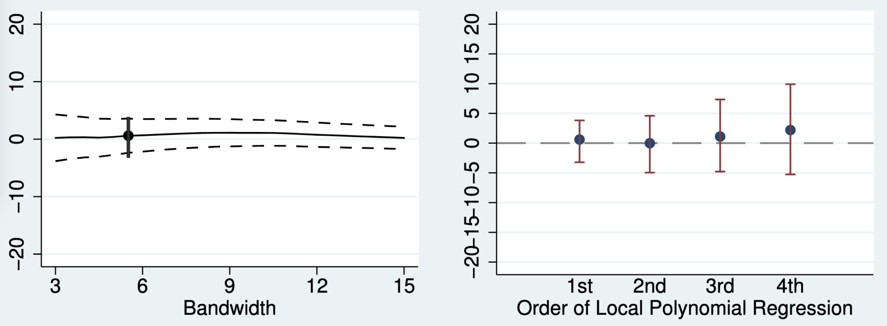

```{r}
#| include: false
pacman::p_load(tidyverse, 
               haven, 
               summarytools,
               modelsummary,
               marginaleffects,
               gt,
               gtExtras,
               ggdag,
               dagitty,
               ggpubr,
               latex2exp,
               rdrobust)
```



```{r}
mlda_df <- read_dta("_data_slide/rdd/AEJfigs.dta")
m_df    <- read_csv("_data_slide/rdd/m_shape.csv") |> 
  mutate(treat = if_else(x >= 0, "t", "c")) 
data("rdrobust_RDsenate", package = "rdrobust")

senate <- rdrobust_RDsenate
```

# **1** RDDとは

## 比例性と投票参加

- 合理的有権者の投票参加モデル（[Riker and Ordeshook 1968](https://doi.org/10.2307/1953324)）
   - $R = P \cdot B - C + D$（$R \leq 0$の場合、棄権）
   - 有権者は自分の持つ一票の価値（$P$）が低いと、棄権しやすい。
- 比例性が高い = 自分の一票が議席に変換される確率が高い = 死票が少ない
- $\Rightarrow$ 比例代表制は投票率を上げる？

```{r}
#| fig-width: 8
#| fig-height: 4
read_csv("data/rdd/ElectoralSystem_Turnout.csv") |> 
  filter(!is.na(System) & System != "Not applicable") |> 
  mutate(System = recode(System, 
                         "PR"     = "比例代表制（79）",
                         "Mixed"  = "混合制（32）",
                         "Other"  = "その他（7）",
                         .default = "多数代表制（80）"),
         System = fct_relevel(System, "多数代表制（80）", "比例代表制（79）",
                              "混合制（32）", "その他（7）")) |> 
  reframe(Turnout = mean(Turnout),
          N       = n(),
          .by     = System) |> 
  ggplot(aes(x = System, y = Turnout)) +
  geom_col(width = 0.5, color = "black") +
  geom_text(aes(label = sprintf("%.1f%%", Turnout)), vjust = -0.35) +
  coord_cartesian(ylim = c(50, 66)) +
  labs(x = "選挙制度（下院選挙）", 
       y = "投票率の平均値\n（%; 直近の選挙）",
       caption = "出典：https://www.idea.int/から取得し、宋が作成") 
```

## 群間単純比較

- 多数代表制の国が比例代表制を採用すると投票率が2.8%p増加する?
   - 比例代表制を採用する国の平均投票率：65.3%
   - 多数代表制を採用する国の平均投票率：62.5%

:::: {.columns}
::: {.column width="40%"}
```{r}
#| fig-width: 3
#| fig-height: 3
dagify(Y ~ D + e,
       D ~ e,
       exposure = "D",
       outcome  = "Y",
       coords = list(x = c(Y = 2, D = 0, e = 1),
                     y = c(Y = 0, D = 0, e = 2))) |> 
  tidy_dagitty() |> 
  mutate(error = if_else(name == "e", "error", "observed"),
         name  = recode(name,
                        "e" = "誤差\n(その他の要因)",
                        "D" = "制度",
                        "Y" = "投票率")) |>
  ggplot(aes(x = x, y = y, xend = xend, yend = yend)) +
  annotate("point", x = 1 - 0.25, y = 2, shape = 15, size = 20) +
  annotate("point", x = 1 + 0.25, y = 2, shape = 15, size = 20) +
  geom_dag_point(aes(size = error, shape = error)) +
  geom_dag_edges() +
  geom_dag_text(col = "white") +
  guides(shape = "none", size = "none") +
  scale_size_manual(values = c("observed" = 20, "error" = 20)) +
  scale_shape_manual(values = c("observed" = 19, "error" = 15)) +
  coord_cartesian(xlim = c(-0.15, 2.15), ylim = c(-0.15, 2.15)) +
  theme_dag() +
  theme(panel.background = element_rect(fill = "transparent", color = NA),
        plot.background  = element_rect(fill = "transparent", color = NA))
```
:::

::: {.column width="60%"}
- 平均値の単純比較の限界
   - 誤差項には政治文化、歴史、経済状況、社会内の対立軸、周辺国の制度、支配国の制度等が含まれる。
   - これらの要因の一部は交絡要因と考えられるため、単純比較から得られた推定値はバイアスを含む。
   - 国固有の文脈[（context）]{.small}により単純比較は困難
   - $\Rightarrow$ 一国内で異なる選挙制度があれば?
:::
::::

```{r}
#| eval: false
read_csv("data/rdd/ElectoralSystem_Turnout.csv") |> 
  select(ISO2, System) |> 
  filter(!is.na(System) & System != "Not applicable" &
         !(ISO2 %in% c("XK", "AN"))) |> 
  drop_na() |> 
  group_by(System) |> 
  nest() |> 
  mutate(country = map(data, \(x) as.vector(x$ISO2))) |> 
  mutate(country = map_chr(country, \(x) str_c(x, collapse = ","))) |> 
  select(System, country) |> 
  ungroup() |> 
  gt() |> 
  fmt_flag(columns = country) 
```

## フランスの例

- コミューン[^commune]（*commune*）議会選挙（1982〜2013[^reform]）
   - 人口3500人未満のコミューン：多数代表制（大選挙区制）
   - 人口3500人以上のコミューン：比例代表制（プレミアム付）
   - 以下は架空のデータ（実際の研究成果は[Eggers[2014]](https://doi.org/10.1177/0010414014534199)等を参照^[Eggers, Andrew C.. 2014. "[Proportionality and Turnout: Evidence From French Municipalities](https://doi.org/10.1177/0010414014534199)." *Comparative Political Studies,* 48(2): 135-167.]）

```{r}
#| layout: [[-5, 40, -10, 40, -5]]
#| fig-width: 5
#| fig-height: 3
set.seed(19861009)
df <- tibble(pop = rnorm(200, mean = 6000, sd = 2500))
df <- df |> 
  mutate(pop = round(pop),
         pop = if_else(pop < 0, pop + 2000, pop),
         system  = if_else(pop >= 3500, 1, 0),
         turnout = 76 - (1/900) * pop + 2 * system + rnorm(200, 0, 2))

df |> 
  mutate(system = if_else(system == 1, "比例代表制", "多数代表制")) |> 
  ggplot(aes(x = pop, y = turnout)) +
  geom_point(aes(color = system), size = 2, alpha = 0.5) +
  geom_smooth(method = "lm", se = FALSE) +
  guides(color = guide_legend(position = "inside")) +
  scale_color_manual(values = c("比例代表制" = "firebrick",
                                "多数代表制" = "royalblue")) +
  scale_x_continuous(breaks = c(1000, 3500, 10000)) +
  labs(x = "人口（人）", y = "投票率（%）", color = "") +
  theme(legend.position.inside = c(1, 1),
        legend.justification   = c(1.75, 0.65)) +
  theme(panel.background      = element_rect(fill = "transparent"),
        plot.background       = element_rect(fill = "transparent", color = NA),
        legend.background     = element_rect(fill = "transparent", color = NA),
        legend.box.background = element_rect(fill = "transparent", color = NA))
  
df |> 
  reframe(turnout = mean(turnout), 
          .by     = system) |> 
  mutate(system = if_else(system == 1, "比例代表制", "多数代表制")) |> 
  ggplot(aes(x = system, y = turnout)) +
  geom_col(width = 0.5, color = "black") +
  geom_text(aes(label = sprintf("%.1f%%", turnout)), vjust = -0.5) +
  coord_cartesian(ylim = c(50, 80)) +
  scale_y_continuous(breaks = seq(50, 80, by = 10)) +
  labs(x = "選挙制度", y = "投票率の平均値（%）") +
  theme(panel.background      = element_rect(fill = "transparent"),
        plot.background       = element_rect(fill = "transparent", color = NA),
        legend.background     = element_rect(fill = "transparent", color = NA),
        legend.box.background = element_rect(fill = "transparent", color = NA))

#ggarrange(fig1, fig2)
```

[^commune]: フランスにおける基礎自治体の最小単位であり、2025年現在、約35,000コミューンが存在する。
[^reform]: 2013年の法改正により閾値が1000人へ引き下げ（2014年選挙から適用）

## 内生性は?

交絡要因の存在により、群間の単純比較では信頼できる処置効果の推定が不可能

- バックドア経路が存在（D $\leftarrow$ R $\rightarrow$ W $\rightarrow$ Y）&nbsp;&nbsp;&nbsp;&nbsp;&nbsp;&nbsp;&nbsp;&nbsp;&nbsp;&nbsp;

:::: {.columns}
::: {.column width="50%"}
```{r}
#| fig-width: 3
#| fig-height: 2.5
dagify(Y ~ D + W,
       D ~ R,
       W ~ R,
       exposure = "D",
       outcome  = "Y",
       latent   = "W",
       coords = list(x = c(Y = 2, D = 0, R = 1, W = 1.5),
                     y = c(Y = 0, D = 0, R = 2, W = 1))) |> 
  tidy_dagitty() |> 
  mutate(latent = if_else(name == "W", "latent", "observed")) |> 
  ggplot(aes(x = x, y = y, xend = xend, yend = yend, shape = latent)) +
  geom_dag_point() +
  geom_dag_edges() +
  geom_dag_text(col = "white") +
  guides(shape = "none") +
  scale_shape_manual(values = c("observed" = 19, "latent" = 15)) +
  coord_cartesian(xlim = c(-0.15, 2.15), ylim = c(-0.15, 2.15)) +
  theme_dag() +
  theme(panel.background = element_rect(fill = "transparent", color = NA),
        plot.background  = element_rect(fill = "transparent", color = NA))
```
:::

::: {.column width="50%"}
- Y：投票率
- D：選挙制度
- R：人口
- W：都市化度

```{r}
df |> 
  filter(pop <= 11000) |> 
  mutate(system = if_else(system == 1, "比例代表制", "多数代表制")) |> 
  ggplot(aes(x = pop, y = turnout)) +
  geom_point(aes(color = system), size = 2, alpha = 0.5) +
  geom_vline(xintercept = 3500, linetype = "dashed") +
  annotate("segment", x = 1000, xend = 10000, y = 77.1, yend = 66.8,
           linewidth = 3, arrow = arrow(type = "closed")) +
  annotate("text", x = 2000, y = 65, label = "低い都市化度\n高い投票率",
           fontface = "bold", color = "firebrick") +
  annotate("text", x = 6000, y = 65, label = "高い都市化度\n低い投票率",
           fontface = "bold", color = "firebrick") +
  guides(color = guide_legend(position = "inside")) +
  scale_color_manual(values = c("比例代表制" = "firebrick",
                                "多数代表制" = "royalblue")) +
  scale_x_continuous(breaks = c(1000, 3500, 10000)) +
  labs(x = "人口（人）", y = "投票率（%）", color = "") +
  theme(legend.position.inside = c(1, 1),
        legend.justification   = c(1, 0.65))
```
:::
::::

## 選挙制度がランダムに?

- 人口が3500人周辺であれば、都市化度はほぼ同じだと考えられる。
   - 人口3400人のコミューンと3600人のコミューンの都市化度は「ほぼ」同じであり、人口が3500人を超えるかどうかは「[**運**]{.alert}」とも言える。
   - $\leadsto$ 内生性の原因（の一つ）である「都市化度」がコントロールされる。
   - $\leadsto$ 区間内において、選挙制度は[「ほぼ」ランダム]{.alert}に決まる（$\fallingdotseq$実験？）。

```{r}
#| fig-width: 8
#| fig-height: 3
fig1 <- df |> 
  mutate(system  = if_else(system == 1, "比例代表制", "多数代表制"),
         in_band = if_else(pop <= 4000 & pop >= 3000, "in", "out")) |> 
  ggplot(aes(x = pop, y = turnout)) +
  geom_point(aes(color = system, alpha = in_band), size = 1.5) +
  geom_vline(xintercept = 3500, linetype = "dashed") +
  ggforce::geom_ellipse(aes(x0 = 3500, y0 = 73, a = 850, b = 6, angle = 0),
                        linewidth = 1.5) +
  guides(alpha = "none", color = guide_legend(position = "inside"), fill = "none") +
  scale_color_manual(values = c("比例代表制" = "firebrick",
                                "多数代表制" = "royalblue")) +
  scale_alpha_manual(values = c("in" = 0.75, "out" = 0.15)) +
  scale_x_continuous(breaks = c(1000, 3500, 10000)) +
  labs(x = "人口（人）", y = "投票率（%）", color = "") +
  theme(legend.position.inside = c(1, 1),
        legend.justification   = c(1.75, 0.65))

fig2 <- df |> 
  filter(pop <= 3600 & pop >= 3400) |> 
  reframe(turnout = mean(turnout), 
          .by     = system) |> 
  mutate(system = if_else(system == 1, "比例代表制", "多数代表制")) |> 
  ggplot(aes(x = system, y = turnout)) +
  geom_col(width = 0.5, color = "black") +
  geom_text(aes(label = sprintf("%.1f%%", turnout)), vjust = -0.5) +
  scale_y_continuous(breaks = c(65, 70, 75)) +
  coord_cartesian(ylim = c(65, 77.5)) +
  labs(x = "選挙制度", y = "投票率の平均値（%）")

ggarrange(fig1, fig2)
```

## 回帰不連続デザイン

- **R**egression **D**iscontinuity **D**esign（[**RDD**]{.alert}）
   - 参考：[Thistlethwaite and Campbell（1960）](https://doi.org/10.1037/h0044319)
- 観測された共変量の値が（制度等によって決められた）閾値のいずれかの側にあるかによって、処置の割り当てが決まる。
   - 「観測された共変量」は[**割当変数**]{.alert}（Running variable）、または**強制変数**（Forcing variable）と呼ばれる。
   - 割当変数（$R_i$）の値が閾値（$c$）を超えた個体を「処置群（$D_i = 1$）」と呼ぶケースが多い。

$$
D_i = \begin{cases}
0 & \textsf{if} & R_i < c \\
1 & \textsf{if} & R_i \geq c
\end{cases} 
$$

- 推定対象（estimand）はATEでなく、[**LATE**]{.alert}（Local ATE; **局所平均処置効果**）

## なぜ「不連続」か

- 回帰直線が上方向（または、下方向）に[**ジャンプ**]{.alert}
   - ジャンプの幅が**LATE**

```{r}
#| fig-width: 8
#| fig-height: 4
df |> 
  mutate(system = if_else(system == 1, "比例代表制", "多数代表制")) |> 
  ggplot(aes(x = pop, y = turnout)) +
  geom_point(aes(color = system), size = 4, alpha = 0.5) +
  annotate("segment", 
           x = 500, xend = 3500, 
           y = 76.263608 - 0.001146 * 500, yend = 76.263608 - 0.001146 * 3500,
           linewidth  = 1.5) +
  annotate("segment", 
           x = 3500, xend = 10000, 
           y = 76.263608 + 1.996864 - 0.001146 * 3500, yend = 76.263608 + 1.996864 - 0.001146 * 10000,
           linewidth  = 1.5) +
  annotate("segment", 
           x = 3500, xend = 3500, 
           y = 76.263608 - 0.001146 * 3500, yend = 76.263608 + 1.996864 - 0.001146 * 3500,
           linewidth  = 1.5, color = "tomato", 
           arrow = arrow(ends = "both", type = "closed", length = unit(0.075, "inches"))) +
  annotate("label",
           x = 3500, y = 73.25, label = "LATE",
           color = "firebrick", fontface = "bold") +
  guides(color = guide_legend(position = "inside")) +
  scale_color_manual(values = c("比例代表制" = "firebrick",
                                "多数代表制" = "royalblue")) +
  scale_x_continuous(breaks = c(1000, 3500, 10000)) +
  coord_cartesian(xlim = c(500, 10000), ylim = c(67.5, 77.5)) +
  labs(x = "人口（人）", y = "投票率（%）", color = "") +
  theme(legend.position.inside = c(1, 1),
        legend.justification   = c(1, 0.65))
```

## 2つのRDD

異なる割当メカニズムを想定した2つのRDD（本講義ではSRDのみ解説）

1. **[Sharp]{.alert} Regression Discontinuity** (SRD)
   - 割当変数の値が閾値を超えると**必ず**処置を受ける。
   - 例) 人口と選挙制度
2. **[Fuzzy]{.alert} Regression Discontinuity** (FRD)
   - 割当変数の値が閾値を超えると処置を受ける**確率**がジャンプする。
   - 例) 入試

## 割当メカニズムの比較

割当変数の値が閾値を超えると、処置を受ける確率が**ジャンプ**する。

```{r}
#| fig-width: 8
#| fig-height: 4
tibble(type  = c(rep("SRDの例", 4),
                 rep("FRDの例（1）", 4),
                 rep("FRDの例（2）", 22)),
       treat = c("統制", "統制", "処置", "処置",
                 "統制", "統制", "処置", "処置",
                 rep("統制", 11), rep("処置", 11)),
       x     = c(-10, 0, 0, 10,
                 -10, 0, 0, 10,
                 -10:0,
                 0:10),
       y     = c(0, 0, 1, 1,
                 0, 0, 0.75, 1,
                 rev((-10:0)^2)/100/4,
                 log(1:11) / log(11) / 4 + 0.75)) |>
  mutate(type = fct_inorder(type)) |>
  ggplot() +
  geom_line(aes(x = x, y = y, color = treat), linewidth = 2) +
  geom_vline(xintercept = 0, linetype = 2) +
  guides(color = "none") +
  scale_x_continuous(breaks = 0, labels = "閾値") +
  labs(x = "割当変数", y = "処置を受ける確率") +
  facet_wrap(~type) +
  theme_bw(base_size = 16) +
  theme(
    panel.background      = element_rect(fill = 'transparent', color = NA),
    plot.background       = element_rect(fill = 'transparent', color = NA),
    legend.background     = element_rect(fill = 'transparent', color = NA),
    legend.box.background = element_rect(fill = 'transparent', color = NA),
    panel.grid            = element_blank()
  )
```

# **2** 仮定

## RDDの仮定（識別条件）

1. 閾値のルールが明確であり、既知であること
   - RDDの場合、閾値は制度に起因するものが多いため、これが問題になるケースは少ない。
1. [潜在的結果の連続性]{.strong}閾値周辺において[潜在的結果が連続]{.strong}であること
1. [共変量の連続性]{.strong}：閾値周辺において結果変数に影響を与える共変量（処置変数を除く）が連続すること
1. [割当変数の非操作性]{.strong}：閾値周辺において割当変数が連続であること

## 潜在的結果の連続性

```{r}
#| fig-width: 8
#| fig-height: 5
mlda_df |> 
  mutate(over21 = if_else(agecell >= 21, 1, 0)) |> 
  ggplot(aes(x = agecell, y = mva)) +
  #geom_point(aes(color = factor(over21)), size = 3) +
  geom_point(size = 3) +
  geom_vline(xintercept = 21, linetype = "dashed") +
  geom_segment(data = tibble(x     = c(19, 21, 21),
                             xend  = c(23, 23, 23),
                             y     = c(35.65, 29.352 - 1, 29.352 + 2),
                             yend  = c(23.054, 23.054 - 1, 23.054 + 2),
                             label = c("潜在的結果が連続",
                                       "潜在的結果が不連続",
                                       "潜在的結果が不連続")) |> 
                 mutate(label = fct_inorder(label)),
               aes(x = x, xend = xend, y = y, yend = yend, color = label),
               linewidth = 1, linetype = "dashed") +
  annotate("segment", linewidth = 1,
           x = 19, xend = 21,
           y = 95.481 - 3.149 * 19, yend = 95.481 - 3.149 * 21) +
  annotate("segment", linewidth = 1,
           x = 21, xend = 23,
           y = 100.015 - 3.149 * 21, yend = 100.015 - 3.149 * 23) +
  guides(color = guide_legend(position = "inside")) +
  scale_color_manual(values = c("潜在的結果が連続" = "firebrick",
                                "潜在的結果が不連続" = "royalblue")) +
  labs(x = "年齢", y = "10万人当り死亡者数（MVA）",
       title = "法的飲酒年齢（MLDA）が21歳の場合",
       caption = "注：Carpenter and Dobkin（2009）のデータを元に宋が作成",
       color = "") +
  coord_cartesian(ylim = c(22.5, 40)) +
  theme(legend.justification.inside = c(0, 0),
        legend.background = element_blank())
```

## 共変量の連続性

- 結果変数に影響を与える変数が閾値周辺で変化しないこと
   - 架空の例）21歳になれば...
      1. [**識別可能**]{.alert}：飲酒ができるようになり、他は何も変わらない。
      2. [**識別不可**]{.alert}：飲酒だけでなく、運転も、宜しくない薬も、結婚もできるようになる。
- 共変量が揃っていれば（限定的ではあるが）バランスチェックで確認可能

```{r}
#| fig-width: 6
#| fig-height: 3
dagify(Y ~ R + D1 + D2 + D3 + D4,
       D1 ~ R,
       D2 ~ R,
       D3 ~ R,
       D4 ~ R,
       coords = list(x = c(Y = 2,   R = 0,   D1 = 1, D2 = 1, D3 = 1, D4 = 1),
                     y = c(Y = 2.5, R = 2.5, D1 = 4, D2 = 3, D3 = 2, D4 = 1))) |>
  tidy_dagitty() |> 
  mutate(name  = recode(name,
                        "Y"  = "死亡",
                        "R"  = "年齢",
                        "D1" = "飲酒",
                        "D2" = "運転",
                        "D3" = "麻薬",
                        "D4" = "婚姻")) |>
  ggplot(aes(x = x, y = y, xend = xend, yend = yend)) +
  geom_dag_point() +
  geom_dag_edges() +
  geom_dag_text() +
  coord_cartesian(xlim = c(-0.15, 2.15), ylim = c(0.975, 4.025)) +
  theme_dag() +
  theme(panel.background = element_rect(fill = "transparent", color = NA),
        plot.background  = element_rect(fill = "transparent", color = NA))
```

## 割当変数の連続性

- 閾値周辺において割当変数の操作が行われていないこと
- [McCrary（2008）](https://doi.org/10.1016/j.jeconom.2007.05.005)の密度検定（density test）で仮定違反有無が確認可能

```{r}
#| fig-width: 8
#| fig-height: 5
set.seed(19861008)
age1 <- runif(10000, 19, 23)
age2 <- if_else(age1 > 20.8 & age1 < 20.99,
                age1 + runif(10000, 0, 0.25), age1)

tibble(type = rep(c("仮定が満たされている例", 
                    "仮定が満たされていない例"),
                  each = 10000),
       age = c(age1, age2)) |> 
  mutate(type = fct_inorder(type)) |> 
  ggplot(aes(x = age, y = after_stat(density))) +
  geom_histogram(color = "black", fill = "lightskyblue",
                 binwidth = 0.5, boundary = 0) +
  geom_vline(xintercept = 21, color = "tomato", 
             linewidth = 1, linetype = "dashed") +
  geom_point(data = tibble(x = c(20.75, 21.25), y = c(0.19, 0.295), 
                           type = "仮定が満たされていない例") |> 
               mutate(type = factor(type, levels = c("仮定が満たされている例",
                                                     "仮定が満たされていない例"))),
             aes(x = x, y = y), 
             size = 12, shape = 1, stroke = 2, color = "firebrick") +
  labs(x = "年齢", y = "密度", 
       title = "法的飲酒年齢（MLDA）が21歳の場合") +
  facet_wrap(~type) +
  theme_bw(base_size = 16) +
  theme(
    panel.background      = element_rect(fill = 'transparent', color = NA),
    plot.background       = element_rect(fill = 'transparent', color = NA),
    legend.background     = element_rect(fill = 'transparent', color = NA),
    legend.box.background = element_rect(fill = 'transparent', color = NA),
    panel.grid            = element_blank()
  )
```

# **3** 推定

## 推定方法

- パラメトリック（parametric）推定
- ノンパラメトリック（non-parametric）推定
   - 局所平均
   - 局所回帰

## パラメトリック推定

[**結果変数を処置変数と割当変数に回帰した（非）線形回帰モデル**]{.alert}

:::: {.columns}
::: {.column width="50%"}
```{r}
#| fig-width: 4
#| fig-height: 4
df |> 
  mutate(system = if_else(system == 1, "処置群", "統制群")) |> 
  ggplot(aes(x = pop, y = turnout)) +
  geom_point(aes(color = system), size = 2, alpha = 0.5) +
  annotate("segment", 
           x = 500, xend = 3500, 
           y = 76.263608 - 0.001146 * 500, yend = 76.263608 - 0.001146 * 3500,
           linewidth  = 1.5) +
  annotate("segment", 
           x = 3500, xend = 10000, 
           y = 76.263608 + 1.996864 - 0.001146 * 3500, yend = 76.263608 + 1.996864 - 0.001146 * 10000,
           linewidth  = 1.5) +
  annotate("segment", 
           x = 3500, xend = 3500, 
           y = 76.263608 - 0.001146 * 3500, yend = 76.263608 + 1.996864 - 0.001146 * 3500,
           linewidth  = 1.5, color = "tomato", 
           arrow = arrow(ends = "both", type = "closed", length = unit(0.075, "inches"))) +
  guides(color = guide_legend(position = "inside")) +
  scale_color_manual(values = c("処置群" = "firebrick",
                                "統制群" = "royalblue")) +
  scale_x_continuous(breaks = c(3500), labels = "閾値") +
  coord_cartesian(xlim = c(500, 10000), ylim = c(67.5, 77.5)) +
  labs(x = "割当変数", y = "結果変数", color = "") +
  theme(legend.position.inside = c(1, 1),
        legend.justification   = c(1, 0.65),
        axis.text.y            = element_blank())
```
:::

::: {.column width="50%"}
$$
\widehat{Y_i} = \alpha + \textcolor{red}{\rho} D_i + \beta R_i
$$

- $Y_i$：結果変数
- $D_i$：処置変数（$D_i \in \{0, 1\}$）
- $R_i$：割当変数

- $\rho$：[**局所処置効果（LATE）**]{.alert}
:::
::::

## 交互作用

閾値を超えることによって回帰直線の傾きが変化すると考えられる場合

- 処置変数と割当変数の交差項を投入

```{r}
#| fig-width: 8
#| fig-height: 5
df <- mlda_df |>
  mutate(over21 = if_else(agecell >= 21, 1, 0)) |> 
  select(age = agecell, death = all, over21)

mlda_df |> 
  mutate(over21 = if_else(agecell >= 21, "t", "c")) |> 
  ggplot(aes(x = agecell, y = all)) +
  geom_point(aes(fill = over21), shape = 21, size = 5, color = "white") +
  geom_vline(xintercept = 21, linetype = "dashed") +
  geom_smooth(aes(group = over21, color = "あり"),
              method = "lm", se = FALSE, linewidth = 1.5) +
  geom_line(data = tibble(agecell = c(19, 21, 21, 23),
                          over21  = c("c", "c", "t", "t"),
                          all     = c(93.7, 91.8, 99.5, 97.6)),
            aes(group = over21, color = "なし"), linewidth = 1.5) +
  guides(fill  = "none",
         color = guide_legend(position = "inside")) +
  labs(x = "割当変数（R）", 
       y = "結果変数（Y）",
       caption = "注：Carpenter and Dobkin（2009）のデータを元に宋が作成",
       color = "交差項") +
  scale_color_manual(values = c("あり" = "#E82825", "なし" = "#0072BB")) +
  theme(legend.position.inside = c(0, 1),
        legend.justification   = c(0, 1))
```

## 交互作用の注意点

$$
\widehat{Y_i} = \alpha + \rho D_i + \beta R_i + \gamma D_i \cdot R_i
$$

- この場合、LATEは$\rho$**ではなく**、$\rho + \gamma \cdot c$
   - 処置効果は$R_i$の値に依存[^interaction]（処置効果は$R_i = c$の箇所のみで観察されるため）
- 閾値（$c$）が0になるように割当変数を調整（=[割当変数を閾値で**中心化**]{.alert}）することを推奨
   - 割当変数の値から閾値を値を引くだけで十分
- 割当変数を$c$で中心化すると、新しい$c$は必ず0
   - LATEは$\rho + \gamma \cdot 0$ = $\rho$

[^interaction]: なぜこうなるのかが分からない場合は、本講義の履修よりも先に交互作用の解釈について勉強すること。交互作用の解釈に関する解説は[Brambor（2006）](https://doi.org/10.1093/pan/mpi014)が詳しい。まだ読んだことない人にもおすすめできる論文だ。

## 中心化の前後比較

$$
\widehat{Y_i} = \alpha + \rho D_i + \beta R_i + \gamma D_i \cdot R_i
$$

```{r}
#| layout: [[-5, 40, -10, 40, -5]]
#| fig-width: 4
#| fig-height: 4
mlda_df |> 
  mutate(over21 = if_else(agecell >= 21, "t", "c")) |> 
  ggplot(aes(x = agecell, y = all, fill = over21, color = over21)) +
  geom_vline(xintercept = 21, linetype = "dashed") +
  geom_point(shape = 21, size = 3, color = "white") +
  annotate("segment",
           x = 19, xend = 21, y = 92.0, yend = 93.6,
           linetype = "solid", linewidth = 1.5, color = "#F8766D") +
  annotate("segment",
           x = 21, xend = 23, y = 93.6, yend = 95.3,
           linetype = "dashed", linewidth = 1.5, color = "#F8766D") +
  annotate("segment",
           x = 19, xend = 21, y = 106.8, yend = 101.3,
           linetype = "dashed", linewidth = 1.5, color = "#00BFC4") +
  annotate("segment",
           x = 21, xend = 23, y = 101.3, yend = 95.7,
           linetype = "solid", linewidth = 1.5, color = "#00BFC4") +
  annotate("segment", 
           x = 19, xend = 19, y = 92.0, yend = 106.8,
           linewidth  = 1.5, color = "firebrick", 
           arrow = arrow(ends = "both", type = "closed", 
                         length = unit(0.075, "inches"))) +
  annotate("label", fontface = "bold", size = 5,
           x = 19, y = 99.4, label = expression(rho)) +
  annotate("segment", 
           x = 21, xend = 21, y = 93.6, yend = 101.3,
           linewidth  = 1.5, color = "firebrick", 
           arrow = arrow(ends = "both", type = "closed", 
                         length = unit(0.075, "inches"))) +
  annotate("label", fontface = "bold", size = 5,
           x = 21, y = 97.5, label = TeX(r"($LATE = \rho + \gamma \cdot c$)")) +
  guides(color    = "none",
         fill     = "none") +
  labs(x = "割当変数（R）", 
       y = "結果変数（Y）",
       title = "中心化 X",
       caption = "　") +
  scale_x_continuous(breaks = 21, labels = "c") +
  theme(axis.text.y = element_blank())

mlda_df |> 
  mutate(over21 = if_else(agecell >= 21, "t", "c")) |> 
  ggplot(aes(x = agecell, y = all, fill = over21, color = over21)) +
  geom_vline(xintercept = 21, linetype = "dashed") +
  geom_point(shape = 21, size = 3, color = "white") +
  annotate("segment",
           x = 19, xend = 21, y = 92.0, yend = 93.6,
           linetype = "solid", linewidth = 1.5, color = "#F8766D") +
  annotate("segment",
           x = 21, xend = 23, y = 93.6, yend = 95.3,
           linetype = "dashed", linewidth = 1.5, color = "#F8766D") +
  annotate("segment",
           x = 19, xend = 21, y = 106.8, yend = 101.3,
           linetype = "dashed", linewidth = 1.5, color = "#00BFC4") +
  annotate("segment",
           x = 21, xend = 23, y = 101.3, yend = 95.7,
           linetype = "solid", linewidth = 1.5, color = "#00BFC4") +
  annotate("segment", 
           x = 21, xend = 21, y = 93.6, yend = 101.3,
           linewidth  = 1.5, color = "firebrick", 
           arrow = arrow(ends = "both", type = "closed", 
                         length = unit(0.075, "inches"))) +
  annotate("label", fontface = "bold", size = 5,
           x = 21, y = 97.5, label = TeX(r"($\LATE = rho$)")) +
  guides(color    = "none",
         fill     = "none") +
  labs(x = "割当変数（R）", 
       y = "結果変数（Y）",
       title = "中心化 O",
       caption = "注：Carpenter and Dobkin（2009）のデータを元に宋が作成") +
  scale_x_continuous(breaks = 21, labels = "c") +
  theme(axis.text.y = element_blank(),
        plot.caption = element_text(size = 10))
```

## 非線形の場合

- 割当変数の2乗項、3乗項、...を投入（[交互作用と組み合わせる場合]{.alert}）

$$
\begin{align}
\widehat{Y_i} = & \alpha + \rho D_i + \beta_1 R_i + \beta_2 R_i^2 + ... + \beta_k R_i^k \textcolor{#E82825}{+} \\
& \textcolor{#E82825}{\gamma_1 (D_i \cdot R_i) + \gamma_2 (D_i \cdot R_i^2) + ... + \gamma_k (D_i \cdot R_i^k)}
\end{align}
$$

- モデル選択の基準の例：$F$検定、AIC、BIC、...
- しかし、高次多項式は推奨されない（[Gelman and Imbens 2018](https://doi.org/10.1080/07350015.2017.1366909)）
   - 高次項を入れるとバイアスは小さくなるが、分散が大きくなる。
      - そもそもRDDにおいてフィットの良さは重要ではない。
   - [Gelman and Imbens（2018）](https://doi.org/10.1080/07350015.2017.1366909)は局所回帰、または二次多項式までを推奨

:::: {.aside}
Gelman, Andrew and Guido Imbens. 2018. "[Why High-Order Polynomials Should Not Be Used in Regression Discontinuity Designs](https://doi.org/10.1080/07350015.2017.1366909)." *Journal of Business & Economic Statistics,* 37(3): 447-456.
::::

## 線形か非線形か

実は閾値周辺で連続する関数（$Y = \frac{1}{1 + e^{-R}}$）だが...

```{r}
#| fig-width: 8
#| fig-height: 4
set.seed(19861009)
df <- tibble(x = runif(250, min = -10, max = 10)) |> 
  mutate(y = 1 / (1 + exp(-x)),
         y = y + rnorm(n(), mean = 0, sd = 0.1)) 

df |> 
  ggplot(aes(x = x, y = y)) +
  geom_point(size = 2, alpha = 0.35, shape = 21, fill = "black", color = "white") +
  geom_line(data = tibble(x = seq(-10, 0, by = 0.5)) |> 
              mutate(y = 1 / (1 + exp(-x))),
            aes(x = x, y = y),
            linewidth = 2, linetype = "dashed", color = "firebrick") +
  geom_line(data = tibble(x = seq(0, 10, by = 0.5)) |> 
              mutate(y = 1 / (1 + exp(-x))),
            aes(x = x, y = y),
            linewidth = 2, linetype = "dashed", color = "royalblue") +
  annotate("segment", x = -10, xend = 0, y = -0.0554, yend = 0.2035,
           linewidth = 2, color = "firebrick") +
  annotate("segment", x = 0, xend = 10, y = 0.74, yend = 1.11,
           linewidth = 2, color = "royalblue") +
  guides(color = "none") +
  labs(x = "割当変数（R）", y = "結果変数（Y）") +
  scale_x_continuous(breaks = 0, labels = "c") +
  theme(axis.text.y  = element_blank(),
        axis.ticks.y = element_blank())
```

## 1次関数の例

```{r}
m_fit1   <- lm(y ~ treat + poly(x, 1), data = m_df)
m_fit1_i <- lm(y ~ treat * poly(x, 1), data = m_df)
m_fit2   <- lm(y ~ treat + poly(x, 2), data = m_df)
m_fit2_i <- lm(y ~ treat * poly(x, 2), data = m_df)
m_fit3   <- lm(y ~ treat + poly(x, 3), data = m_df)
m_fit3_i <- lm(y ~ treat * poly(x, 3), data = m_df)
m_fit4   <- lm(y ~ treat + poly(x, 4), data = m_df)
m_fit4_i <- lm(y ~ treat * poly(x, 4), data = m_df)
m_fit5   <- lm(y ~ treat + poly(x, 5), data = m_df)
m_fit5_i <- lm(y ~ treat * poly(x, 5), data = m_df)
```

$Y_i = \alpha + \rho D_i + \beta R_i + \varepsilon_i$

```{r}
#| fig-width: 6
#| fig-height: 3.5
m_df |> 
  ggplot(aes(x = x, y = y)) +
  geom_point(aes(fill = treat),
             shape = 21, color = "white", size = 2, alpha = 0.5) +
  geom_line(data = m_fit1 |> 
              predictions(newdata = datagrid(x     = seq(-10, 0, 0.1),
                                             treat = "c")),
            aes(x = x, y = estimate),
            linewidth = 2, color = "firebrick") +
  geom_line(data = m_fit1 |> 
              predictions(newdata = datagrid(x     = seq(0, 10, 0.1),
                                             treat = "t")),
            aes(x = x, y = estimate),
            linewidth = 2, color = "royalblue") +
  geom_vline(xintercept = 0, linetype = "dashed") +
  coord_cartesian(ylim = c(-100, 350)) +
  guides(fill = "none", color = "none") +
  labs(x = "割当変数", y = "結果変数")
```

## 1次関数 + 交差項の例

$Y_i = \alpha + \rho D_i + \beta R_i + \gamma D_i \cdot R_i + \varepsilon_i$

```{r}
#| fig-width: 6
#| fig-height: 3.5
m_df |> 
  ggplot(aes(x = x, y = y)) +
  geom_point(aes(fill = treat),
             shape = 21, color = "white", size = 2, alpha = 0.5) +
  geom_line(data = m_fit1_i |> 
              predictions(newdata = datagrid(x     = seq(-10, 0, 0.1),
                                             treat = "c")),
            aes(x = x, y = estimate),
            linewidth = 2, color = "firebrick") +
  geom_line(data = m_fit1_i |> 
              predictions(newdata = datagrid(x     = seq(0, 10, 0.1),
                                             treat = "t")),
            aes(x = x, y = estimate),
            linewidth = 2, color = "royalblue") +
  geom_vline(xintercept = 0, linetype = "dashed") +
  coord_cartesian(ylim = c(-100, 350)) +
  guides(fill = "none", color = "none") +
  labs(x = "割当変数", y = "結果変数")
```

## 2次関数の例

$Y_i = \alpha + \rho D_i + \beta_1 R_i + \beta_1 R_i^2 + \varepsilon_i$

```{r}
#| fig-width: 6
#| fig-height: 3.5
m_df |> 
  ggplot(aes(x = x, y = y)) +
  geom_point(aes(fill = treat),
             shape = 21, color = "white", size = 2, alpha = 0.5) +
  geom_line(data = m_fit2 |> 
              predictions(newdata = datagrid(x     = seq(-10, 0, 0.1),
                                             treat = "c")),
            aes(x = x, y = estimate),
            linewidth = 2, color = "firebrick") +
  geom_line(data = m_fit2 |> 
              predictions(newdata = datagrid(x     = seq(0, 10, 0.1),
                                             treat = "t")),
            aes(x = x, y = estimate),
            linewidth = 2, color = "royalblue") +
  geom_vline(xintercept = 0, linetype = "dashed") +
  coord_cartesian(ylim = c(-100, 350)) +
  guides(fill = "none", color = "none") +
  labs(x = "割当変数", y = "結果変数")
```

## 2次関数 + 交差項の例

$Y_i = \alpha + \rho D_i + \beta_1 R_i + \beta_1 R_i^2 + \gamma_1 D_i \cdot R_i + \gamma_1 D_i \cdot R_i^2 + \varepsilon_i$

```{r}
#| fig-width: 6
#| fig-height: 3.5
m_df |> 
  ggplot(aes(x = x, y = y)) +
  geom_point(aes(fill = treat),
             shape = 21, color = "white", size = 2, alpha = 0.5) +
  geom_line(data = m_fit2_i |> 
              predictions(newdata = datagrid(x     = seq(-10, 0, 0.1),
                                             treat = "c")),
            aes(x = x, y = estimate),
            linewidth = 2, color = "firebrick") +
  geom_line(data = m_fit2_i |> 
              predictions(newdata = datagrid(x     = seq(0, 10, 0.1),
                                             treat = "t")),
            aes(x = x, y = estimate),
            linewidth = 2, color = "royalblue") +
  geom_vline(xintercept = 0, linetype = "dashed") +
  coord_cartesian(ylim = c(-100, 350)) +
  guides(fill = "none", color = "none") +
  labs(x = "割当変数", y = "結果変数")
```

## 3次関数の例

$Y_i = \alpha + \rho D_i + \sum_{j=1}^3 \beta_j R_i^j + \varepsilon_i$

```{r}
#| fig-width: 6
#| fig-height: 3.5
m_df |> 
  ggplot(aes(x = x, y = y)) +
  geom_point(aes(fill = treat),
             shape = 21, color = "white", size = 2, alpha = 0.5) +
  geom_line(data = m_fit3 |> 
              predictions(newdata = datagrid(x     = seq(-10, 0, 0.1),
                                             treat = "c")),
            aes(x = x, y = estimate),
            linewidth = 2, color = "firebrick") +
  geom_line(data = m_fit3 |> 
              predictions(newdata = datagrid(x     = seq(0, 10, 0.1),
                                             treat = "t")),
            aes(x = x, y = estimate),
            linewidth = 2, color = "royalblue") +
  geom_vline(xintercept = 0, linetype = "dashed") +
  coord_cartesian(ylim = c(-100, 350)) +
  guides(fill = "none", color = "none") +
  labs(x = "割当変数", y = "結果変数")
```

## 3次関数 + 交差項の例

$Y_i = \alpha + \rho D_i + \sum_{j=1}^3 \beta_j R_i^j + \sum_{k=1}^3 \gamma_k D_i \cdot R_i^k + \varepsilon_i$

```{r}
#| fig-width: 6
#| fig-height: 3.5
m_df |> 
  ggplot(aes(x = x, y = y)) +
  geom_point(aes(fill = treat),
             shape = 21, color = "white", size = 2, alpha = 0.5) +
  geom_line(data = m_fit3_i |> 
              predictions(newdata = datagrid(x     = seq(-10, 0, 0.1),
                                             treat = "c")),
            aes(x = x, y = estimate),
            linewidth = 2, color = "firebrick") +
  geom_line(data = m_fit3_i |> 
              predictions(newdata = datagrid(x     = seq(0, 10, 0.1),
                                             treat = "t")),
            aes(x = x, y = estimate),
            linewidth = 2, color = "royalblue") +
  geom_vline(xintercept = 0, linetype = "dashed") +
  coord_cartesian(ylim = c(-100, 350)) +
  guides(fill = "none", color = "none") +
  labs(x = "割当変数", y = "結果変数")
```

## 4次関数の例

$Y_i = \alpha + \rho D_i + \sum_{j=1}^4 \beta_j R_i^j + \varepsilon_i$

```{r}
#| fig-width: 6
#| fig-height: 3.5
m_df |> 
  ggplot(aes(x = x, y = y)) +
  geom_point(aes(fill = treat),
             shape = 21, color = "white", size = 2, alpha = 0.5) +
  geom_line(data = m_fit4 |> 
              predictions(newdata = datagrid(x     = seq(-10, 0, 0.1),
                                             treat = "c")),
            aes(x = x, y = estimate),
            linewidth = 2, color = "firebrick") +
  geom_line(data = m_fit4 |> 
              predictions(newdata = datagrid(x     = seq(0, 10, 0.1),
                                             treat = "t")),
            aes(x = x, y = estimate),
            linewidth = 2, color = "royalblue") +
  geom_vline(xintercept = 0, linetype = "dashed") +
  coord_cartesian(ylim = c(-100, 350)) +
  guides(fill = "none", color = "none") +
  labs(x = "割当変数", y = "結果変数")
```

## 4次関数 + 交差項の例

$Y_i = \alpha + \rho D_i + \sum_{j=1}^4 \beta_j R_i^j + \sum_{k=1}^4 \gamma_k D_i \cdot R_i^k + \varepsilon_i$

```{r}
#| fig-width: 6
#| fig-height: 3.5
m_df |> 
  ggplot(aes(x = x, y = y)) +
  geom_point(aes(fill = treat),
             shape = 21, color = "white", size = 2, alpha = 0.5) +
  geom_line(data = m_fit4_i |> 
              predictions(newdata = datagrid(x     = seq(-10, 0, 0.1),
                                             treat = "c")),
            aes(x = x, y = estimate),
            linewidth = 2, color = "firebrick") +
  geom_line(data = m_fit4_i |> 
              predictions(newdata = datagrid(x     = seq(0, 10, 0.1),
                                             treat = "t")),
            aes(x = x, y = estimate),
            linewidth = 2, color = "royalblue") +
  geom_vline(xintercept = 0, linetype = "dashed") +
  coord_cartesian(ylim = c(-100, 350)) +
  guides(fill = "none", color = "none") +
  labs(x = "割当変数", y = "結果変数")
```

## 5次関数の例

$Y_i = \alpha + \rho D_i + \sum_{j=1}^5 \beta_j R_i^j + \varepsilon_i$

```{r}
#| fig-width: 6
#| fig-height: 3.5
m_df |> 
  ggplot(aes(x = x, y = y)) +
  geom_point(aes(fill = treat),
             shape = 21, color = "white", size = 2, alpha = 0.5) +
  geom_line(data = m_fit5 |> 
              predictions(newdata = datagrid(x     = seq(-10, 0, 0.1),
                                             treat = "c")),
            aes(x = x, y = estimate),
            linewidth = 2, color = "firebrick") +
  geom_line(data = m_fit5 |> 
              predictions(newdata = datagrid(x     = seq(0, 10, 0.1),
                                             treat = "t")),
            aes(x = x, y = estimate),
            linewidth = 2, color = "royalblue") +
  geom_vline(xintercept = 0, linetype = "dashed") +
  coord_cartesian(ylim = c(-100, 350)) +
  guides(fill = "none", color = "none") +
  labs(x = "割当変数", y = "結果変数")
```

## 5次関数 + 交差項の例

$Y_i = \alpha + \rho D_i + \sum_{j=1}^5 \beta_j R_i^j + \sum_{k=1}^5 \gamma_k D_i \cdot R_i^k + \varepsilon_i$

```{r}
#| fig-width: 6
#| fig-height: 3.5
m_df |> 
  ggplot(aes(x = x, y = y)) +
  geom_point(aes(fill = treat),
             shape = 21, color = "white", size = 2, alpha = 0.5) +
  geom_line(data = m_fit5_i |> 
              predictions(newdata = datagrid(x     = seq(-10, 0, 0.1),
                                             treat = "c")),
            aes(x = x, y = estimate),
            linewidth = 2, color = "firebrick") +
  geom_line(data = m_fit5_i |> 
              predictions(newdata = datagrid(x     = seq(0, 10, 0.1),
                                             treat = "t")),
            aes(x = x, y = estimate),
            linewidth = 2, color = "royalblue") +
  geom_vline(xintercept = 0, linetype = "dashed") +
  coord_cartesian(ylim = c(-100, 350)) +
  guides(fill = "none", color = "none") +
  labs(x = "割当変数", y = "結果変数")
```

## LATEの推定値

```{r}
#| fig-width: 6
#| fig-height: 4
list("1_交差項なし" = m_fit1,
     "1_交差項あり" = m_fit1_i,
     "2_交差項なし" = m_fit2,
     "2_交差項あり" = m_fit2_i,
     "3_交差項なし" = m_fit3,
     "3_交差項あり" = m_fit3_i,
     "4_交差項なし" = m_fit4,
     "4_交差項あり" = m_fit4_i,
     "5_交差項なし" = m_fit5,
     "5_交差項あり" = m_fit5_i) |> 
  enframe() |> 
  mutate(value = map(value, 
                     \(x) avg_slopes(variable = "treat", x, 
                                     newdata = datagrid(x = 0)))) |> 
  unnest(value) |> 
  select(name, estimate, conf.low, conf.high) |> 
  separate(col  = name,
           into = c("order", "interaction"),
           sep  = "_") |> 
  mutate(interaction = fct_inorder(interaction)) |> 
  ggplot(aes(x = order, y = estimate, 
             ymin = conf.low, ymax = conf.high)) +
  geom_hline(yintercept = 45) +
  geom_pointrange() +
  labs(x = "次数", y = "LATEの推定値と95%信頼区間") +
  facet_wrap(. ~ interaction, scales = "free_y") +
  theme_bw(base_size = 16) +
  theme(
    panel.background      = element_rect(fill = 'transparent', color = NA),
    plot.background       = element_rect(fill = 'transparent', color = NA),
    legend.background     = element_rect(fill = 'transparent', color = NA),
    legend.box.background = element_rect(fill = 'transparent', color = NA),
    panel.grid            = element_blank()
  ) +
  theme(legend.position = "bottom")
```

## モデルの適合度

```{r}
#| fig-width: 6
#| fig-height: 4
list("1_なし" = m_fit1,
     "1_あり" = m_fit1_i,
     "2_なし" = m_fit2,
     "2_あり" = m_fit2_i,
     "3_なし" = m_fit3,
     "3_あり" = m_fit3_i,
     "4_なし" = m_fit4,
     "4_あり" = m_fit4_i,
     "5_なし" = m_fit5,
     "5_あり" = m_fit5_i) |> 
  enframe() |> 
  mutate(value = map(value, \(x) get_gof(x))) |> 
  unnest(value) |> 
  select(name, aic, r.squared) |> 
  separate(col  = name,
           into = c("order", "interaction"),
           sep  = "_") |> 
  pivot_longer(cols = aic:r.squared) |> 
  mutate(name = if_else(name == "aic", "AIC", "決定係数")) |> 
  ggplot(aes(x = order, y = value)) +
  geom_line(aes(color = interaction, group = interaction),
            linewidth = 1) +
  geom_point(aes(fill = interaction), 
             shape = 21, color = "white", size = 3) +
  labs(x = "次数", y = "適合度", color = "交差項", fill = "交差項") +
  facet_wrap(. ~ name, scales = "free_y") +
  theme_bw(base_size = 16) +
  theme(
    panel.background      = element_rect(fill = 'transparent', color = NA),
    plot.background       = element_rect(fill = 'transparent', color = NA),
    legend.background     = element_rect(fill = 'transparent', color = NA),
    legend.box.background = element_rect(fill = 'transparent', color = NA),
    panel.grid            = element_blank()
  ) +
  theme(legend.position = "bottom")
```

## ノンパラメトリック推定

### パラメトリックのデメリット

- 結果変数と割当変数間の関数形の特定が重要
   - 線形? 非線形（2次? 3次? 4次?）? 交差項?
- 関数形の誤設定[（misspecification）]{.small}はバイアスの原因

### ノンパラメトリック推定

- [閾値周辺の個体のみを対象]{.strong}とし、処置群と統制群間の結果変数の平均値の差を比較
   - $c - h \leq R \leq c + h$の個体のみ使用（$h$は[バンド幅]{.strong}[（bandwidth）]{.small}と呼ばれる）
- 2つの推定方法
   - 局所平均（単純平均であるため、結果変数と割当変数間の関数形の特定が不要）
   - [局所線形回帰分析]{.strong}[（local linear regression）]{.small}
      - 現時点の主流であり、関数形の特定は必要だが、誤設定の影響が小さい。

## 局所平均

- 全体平均の$\widehat{\textsf{LATE}}$：$\mathbb{E}[Y | c \leq R] - \mathbb{E}[Y | R < c]$
- 局所平均の$\widehat{\textsf{LATE}}$：$\mathbb{E}[Y | c \leq R \leq c + h] - \mathbb{E}[Y | c - h \leq R < c]$
- [**カーネル関数を使用した加重平均**]{.alert}[（Nadaraya-Watson推定量）]{.small}
   - 通常の算術平均も一様[(uniform)]{.small}カーネル関数[^rectangular]に基づく加重平均とみなせる

[^rectangular]: 長方形（rectangular）カーネル関数とも呼ばれる。

```{r}
#| layout: [[-5, 40, -10, 40, -5]]
#| fig-width: 4
#| fig-height: 2.5
mlda_df |> 
  mutate(over21 = if_else(agecell >= 21, "処置群", "統制群")) |> 
  ggplot() +
  geom_point(aes(x = agecell, y = mva, fill = over21),
             shape = 21, size = 3) +
  geom_line(data = tibble(x      = c(19, 21, 21, 23),
                          y      = c(32.5, 32.5, 30.8, 30.8),
                          over21 = c("統制群", "統制群", 
                                     "処置群", "処置群")),
            aes(x = x, y = y, color = over21), linewidth = 2) +
  geom_vline(xintercept = 21, linetype = "dashed") +
  annotate("segment", x = 21, xend = 21, y = 32.5, yend = 30.8,
           linewidth  = 1.5, color = "firebrick", 
           arrow = arrow(type = "closed", 
                         length = unit(0.15, "inches"))) +
  guides(fill = "none", color = "none") +
  labs(x = "割当変数", y = "結果変数", 
       title = "全体平均（global means）") +
  scale_x_continuous(breaks = 21, labels = "c") +
  theme(axis.text.y = element_blank())

mlda_df |> 
  mutate(over21 = if_else(agecell >= 21, "処置群", "統制群"),
         inout  = if_else(agecell >= 20.5 & agecell <= 21.5,
                          "in", "out")) |> 
  ggplot() +
  geom_point(aes(x = agecell, y = mva, fill = over21, alpha = inout),
             shape = 21, size = 3) +
  geom_line(data = tibble(x      = c(20.5, 21, 21, 21.5),
                          y      = c(30.3, 30.3, 33.6, 33.6),
                          over21 = c("統制群", "統制群", 
                                     "処置群", "処置群")),
            aes(x = x, y = y, color = over21), linewidth = 2) +
  geom_vline(xintercept = c(20.5, 21.5)) +
  geom_vline(xintercept = 21, linetype = "dashed") +
  annotate("segment", x = 21, xend = 21, y = 30.3, yend = 33.6,
           linewidth  = 1.5, color = "firebrick", 
           arrow = arrow(type = "closed", 
                         length = unit(0.15, "inches"))) +
  guides(fill = "none", color = "none", alpha = "none") +
  labs(x = "割当変数", y = "結果変数", 
       title = "局所平均（local means）") +
  scale_x_continuous(breaks = c(20.5, 21, 21.5), 
                     labels = c("c - h", "c", "c + h")) +
  scale_alpha_manual(values = c("in" = 1, "out" = 0.15)) +
  theme(axis.text.y = element_blank())

#ggarrange(fig1, fig2)
```

:::: {.aside}
注：Carpenter and Dobkin（2009）のデータを元に宋が作成
::::

## バンド幅

- 最適なバンド幅を決めるたった一つのルールは存在しない
   - [Lee and Lemieux（2010）](https://doi.org/10.1257/jel.48.2.281)、[Imbens and Kalyanaraman（2012）](https://doi.org/10.1093/restud/rdr043)、[Calonico et al.（2014）](https://doi.org/10.3982/ECTA11757)、[Arai and Ichimura（2018）](https://doi.org/10.3982/QE590)、[Calonico et al.（2019）](https://doi.org/10.3150/21-BEJ1445)、[Calonico et al.（2020）](https://doi.org/10.1093/ectj/utz022)など
      - 多くはMSE[（mean squared error）]{.small}の最小化を目指している。
   - 現在、一般的に採用されているのは[**Imbens and Kalyanaraman（2012）**]{.alert}の方法^[ただし、現在最も幅広く使われている{rdrobust}パッケージは[Calonico et al.（2014）](https://doi.org/10.3982/ECTA11757)が提唱する通称、「CCTバンド幅」である。]

- [バンド幅によってLATEの推定値は変わり得る]{.strong}
   - 多少の変動は仕方ないが、バンド幅が少し変わっただけでLATEの推定値が大きく変化することは望ましくない。
   - $\Rightarrow$ [**感度分析**]{.alert}[（sensitivity analysis）]{.small}を推奨
      - バンド幅を最適バンド幅を中心に少しずつ変えながらLATEの推定値の変化を示す

## 局所回帰分析

ハンド幅内の個体のみを用いたパラメトリック推定法[（[Hahn, Todd, and van der Klaauw 2001](https://doi.org/10.1111/1468-0262.00183)）]{.small}

- 「線形+交差項」か「二次多項式+交差項」で十分な場合が多い

```{r}
#| layout: [[30,-5,30,-5,30]]
#| fig-width: 3
#| fig-height: 3.5
m_fit <- m_df |> 
  lm(y ~ treat * poly(x, 3), data = _)

m_line <- predictions(m_fit, 
                      newdata = datagrid(x = seq(-10, 0, by = 0.1),
                                         treat = "c")) |> 
  bind_rows(predictions(m_fit, 
                        newdata = datagrid(x = seq(0, 10, by = 0.1),
                                           treat = "t")))
m_df |> 
  ggplot() +
  geom_point(aes(x = x, y = y), size = 2, alpha = 0.35) +
  geom_line(data = m_line,
            aes(x = x, y = estimate, color = treat),
            linewidth = 2) +
  geom_vline(xintercept = 0, linetype = "dashed") +
  guides(color = "none") +
  labs(x = "割当変数", y = "結果変数") +
  ggtitle("\nパラメトリック推定") +
  scale_x_continuous(breaks = c(-5, 0, 5),
                     labels = c("c - h", "c", "c + h")) +
  theme(axis.text.y  = element_blank(),
        axis.ticks.y = element_blank())

m_df |> 
  mutate(inout = if_else(x >= -5 & x <= 5, "in", "out")) |> 
  ggplot() +
  geom_point(aes(x = x, y = y, alpha = inout), 
             size = 2) +
  annotate("segment",
           x = -5, xend = 0, y = 63.04756, yend = 63.04756,
           linewidth = 2, color = "#F8766D") +
  annotate("segment",
           x = 0, xend = 5, y = 106.63519, yend = 106.63519,
           linewidth = 2, color = "#00BFC4") +
  geom_vline(xintercept = 0, linetype = "dashed") +
  geom_vline(xintercept = c(-5, 5), linetype = "solid") +
  scale_alpha_manual(values = c("in" = 0.35, "out" = 0.1)) +
  guides(color = "none", alpha = "none") +
  labs(x = "割当変数", y = "結果変数") +
  ggtitle("ノンパラメトリック推定\n（局所平均）") +
  scale_x_continuous(breaks = c(-5, 0, 5),
                     labels = c("c - h", "c", "c + h")) +
  theme(axis.text.y  = element_blank(),
        axis.ticks.y = element_blank())

m_df |> 
  mutate(inout = if_else(x >= -5 & x <= 5, "in", "out")) |> 
  ggplot() +
  geom_point(aes(x = x, y = y, alpha = inout), 
             size = 2) +
  annotate("segment",
           x = -5, xend = 0, y = 133.9, yend = -22.8,
           linewidth = 2, color = "#F8766D") +
  annotate("segment",
           x = 0, xend = 5, y = 17, yend = 196,
           linewidth = 2, color = "#00BFC4") +
  geom_vline(xintercept = 0, linetype = "dashed") +
  geom_vline(xintercept = c(-5, 5), linetype = "solid") +
  scale_alpha_manual(values = c("in" = 0.35, "out" = 0.1)) +
  guides(color = "none", alpha = "none") +
  labs(x = "割当変数", y = "結果変数") +
  ggtitle("ノンパラメトリック推定\n（局所回帰）") +
  scale_x_continuous(breaks = c(-5, 0, 5),
                     labels = c("c - h", "c", "c + h")) +
  theme(axis.text.y  = element_blank(),
        axis.ticks.y = element_blank())
```

:::: {.aside}
- Hahn, Jinyong, Petra Todd, and Wilbert Van der Klaauw. 2001. "[Identification and Estimation of Treatment Effects with a Regression-Discontinuity Design](https://doi.org/10.1111/1468-0262.00183)." *Econometrica,* 69 (1): 201-209.
::::

## 局所平均と局所回帰

- **境界問題**によるバイアスの発生[（[Hahn, Todd, and van der Klaauw 2001](https://doi.org/10.1111/1468-0262.00183)）]{.small}
   - 以下の例は長方形カーネル関数に基づく局所平均

```{r}
#| fig-width: 6
#| fig-height: 4
set.seed(19861008)
df1 <- tibble(x = seq(-10, 10, 0.25),
              t = if_else(x < 0, 0, 1),
              y = -5 * t + x + rnorm(81, 0, 1)) |> 
  mutate(inout = if_else(x >= -5 & x <= 5, "in", "out"))

df2 <- tibble(x = seq(-10, 10, 0.25),
              t = if_else(x < 0, 0, 1),
              y = x + rnorm(81, 0, 1)) |> 
  mutate(inout = if_else(x >= -5 & x <= 5, "in", "out"))

df3 <- tibble(x = seq(-10, 10, 0.25),
              t = if_else(x < 0, 0, 1),
              y = -5 * t + x + 2 * t * x+ rnorm(81, 0, 1)) |> 
  mutate(inout = if_else(x >= -5 & x <= 5, "in", "out"))

fit_df <- tibble(case  = rep(rep(c("第一種の過誤の例",
                                   "第二種の過誤の例",
                                   "LATEの符号が逆転"), each = 2), 2),
                 model = rep(c("局所平均", "局所回帰"), each = 6),
                 t     = rep(c("control", "treat"), 6),
                 x     = rep(c(-5, 0), 6),
                 xend  = rep(c(0, 5), 6),
                 y     = c(-2.50, 2.30, -2.79, -2.39,-2.57, 2.10,
                           -4.66, -0.52, -5.38, -5.25, -5.02, -6.00),
                 yend  = c( -2.50, 2.30, -2.79, -2.39,-2.57, 2.10,
                           -0.10, 5.11, 0.070, 0.47, 0.13, 10.19)) |> 
  mutate(case  = fct_inorder(case),
         model = fct_inorder(model))

list("第一種の過誤の例_局所平均" = df2,
     "第二種の過誤の例_局所平均" = df1,
     "LATEの符号が逆転_局所平均" = df3,
     "第一種の過誤の例_局所回帰" = df2,
     "第二種の過誤の例_局所回帰" = df1,
     "LATEの符号が逆転_局所回帰" = df3) |> 
  bind_rows(.id = "case") |> 
  separate(col  = case,
           into = c("case", "model"),
           sep  = "_") |> 
  mutate(t     = if_else(t == 1, "treat", "control"),
         case  = fct_inorder(case),
         model = fct_inorder(model)) |> 
  ggplot(aes(x = x, y = y)) +
  geom_point(aes(alpha = inout, fill = t), 
             size = 1.5, shape = 21, color = "white") +
  geom_vline(xintercept = 0, linetype = "dashed") +
  geom_vline(xintercept = -5, linetype = "solid") +
  geom_vline(xintercept = 5, linetype = "solid") +
  geom_segment(data = fit_df, 
               aes(x = x, xend = xend, y = y, yend = yend, 
                   color = t),
               linewidth = 1) +
  guides(alpha = "none", fill = "none", color = "none") +
  labs(x = "割当変数", y = "結果変数") +
  scale_x_continuous(breaks = c(-5, 0, 5),
                     labels = c("c-h", "c", "c+h")) +
  scale_alpha_manual(values = c("in" = 1, "out" = 0.15)) +
  scale_color_manual(values = c("control" = "firebrick",
                                "treat"   = "royalblue")) +
  facet_grid(model ~ case, scales = "free_y") +
  theme_bw(base_size = 16) +
  theme(panel.background      = element_rect(fill = "transparent"),
        plot.background       = element_rect(fill = "transparent", color = NA),
        legend.background     = element_rect(fill = "transparent", color = NA),
        legend.box.background = element_rect(fill = "transparent", color = NA)) +
  theme(axis.ticks.y = element_blank(),
        axis.text.y  = element_blank())
```

## カーネル関数

閾値における処置効果に興味があるため、[**閾値に近い個体ほど高い重み**]{.alert}を付ける

- バンド幅外の個体には重み0を付ける
- 重み付けのルール：[**カーネル関数**]{.alert}（kernel function）
   - **一様/長方形**カーネル関数：すべての個体の重みが同じ（=重み付けなし）
   - **三角形**カーネル関数：LATE推定に最適なカーネル関数（[Fan and Gijbels 1996](https://amzn.asia/d/i5vsRUg)）
   - ほとんどのパッケージは三角形カーネル関数がデフォルト
- カーネル関数が推定値に与える影響は限定的（[Lee and Lemieux 2010](https://doi.org/10.1257/jel.48.2.281)）

```{r}
#| fig-width: 6
#| fig-height: 3
mlda_df |> 
  mutate(over21 = if_else(agecell >= 21, "処置群", "統制群"),
         inout  = if_else(agecell >= 20 & agecell <= 22, "in", "out")) |> 
  ggplot() +
  annotate("rect", xmin = 19, xmax = 23, ymin = 25, ymax = 40,
           alpha = 0.15) +
  annotate("rect", xmin = 20, xmax = 22, ymin = 25, ymax = 40,
           alpha = 0.25) +
  annotate("rect", xmin = 20.33, xmax = 21.66, ymin = 25, ymax = 40,
           alpha = 0.35) +
  annotate("rect", xmin = 20.66, xmax = 21.33, ymin = 25, ymax = 40,
           alpha = 0.45) +
  annotate("text", x = c(19.5, 22.5), y = 27.5, 
           label = "重みなし", fontface = "bold", size = 5) +
  annotate("text", x = c(20.15, 21.85), y = 27.5, 
           label = "低", fontface = "bold", size = 5) +
  annotate("text", x = c(20.5, 21.5), y = 27.5, 
           label = "中", fontface = "bold", size = 5) +
  annotate("text", x = c(20.85, 21.15), y = 27.5, 
           label = "高", fontface = "bold", size = 5) +
  geom_point(aes(x = agecell, y = mva, fill = over21, alpha = inout),
             shape = 21, size = 3) +
  geom_vline(xintercept = 21, linetype = "dashed") +
  geom_vline(xintercept = c(20, 22), linetype = "solid") +
  guides(fill = "none", color = "none", alpha = "none") +
  labs(x = "割当変数", y = "結果変数", 
       caption = "") +
  scale_alpha_manual(values = c("in" = 1, "out" = 0.15)) +
  coord_cartesian(ylim = c(27, 37)) +
  scale_x_continuous(breaks = 20:22, 
                     labels = c("c-h", "c", "c+h")) +
  theme(axis.text.y  = element_blank(),
        axis.ticks.y = element_blank(),
        plot.margin  = unit(c(0, 0, 0, 0), "points"))
```

## 様々なカーネル関数

{width=1000px fig-align="center"}

:::: {.aside}
出典：[Wikipedia](https://en.wikipedia.org/wiki/Kernel_(statistics))
::::

# **4** 実装例

<!--

## 推定（パッケージ）

パッケージによってバンド幅、局所回帰分析の関数形、標準誤差の計算方法が異なるので、事前に確認しておくこと。

- 推定用
   - {[rdd](https://cran.r-project.org/web/packages/rdd/)}
   - {[rdrobust](https://rdpackages.github.io/rdrobust/)}
   - {[rddapp](https://www.felixthoemmes.com/rddapp/)}：推定 + ツールボックス
   - {[SpatialRDD](https://cran.r-project.org/web/packages/SpatialRDD/index.html)}：地理的RDD
- ツールボックス系
   - {[rddtools](https://cran.r-project.org/web/packages/rddtools/)}
   - {[rddensity](https://rdpackages.github.io/rddensity/)}
-->

## 可視化（散布図）

- 方法1：割当変数と結果変数の散布図（左）
   - 個体が多い場合、傾向が読み取りにくい。
- 方法2：割当変数の**区間**と結果変数の**平均値**の散布図（右）

```{r}
#| layout: [[-5, 40, -10, 40, -5]]
#| fig-width: 5
#| fig-height: 4
senate |> 
  mutate(t = if_else(margin > 0, "t", "c")) |> 
  ggplot(aes(x = margin, y = vote)) +
  geom_point(aes(fill = t), shape = 21, color = "white", alpha = 0.5) +
  geom_vline(xintercept = 0, linetype = "dashed") +
  geom_smooth(aes(x = margin, y = vote, group = t), 
              method = "loess", color = "black", linewidth = 0.5) +
  guides(fill = "none") +
  labs(x = "t期における\n（民主党候補の得票率 - 共和党候補の得票率）",
       y = "民主党候補者の得票率（t+1）")

senate |>
  mutate(margin2 = cut(margin, 
                       breaks = seq(-100, 100, 2), 
                       labels = seq(-99, 99, 2),
                       include.lowest = TRUE),
         margin2 = as.numeric(as.character(margin2))) |>
  reframe(vote = mean(vote, na.rm = TRUE), .by = margin2) |> 
  mutate(t = if_else(margin2 > 0, "t", "c")) |> 
  ggplot(aes(x = margin2, y = vote)) +
  geom_point(aes(fill = t), 
             size = 2, shape = 21, color = "white", alpha = 0.75) +
  geom_smooth(data = senate |> mutate(t = if_else(margin > 0, "t", "c")), 
              aes(x = margin, y = vote, group = t), 
              method = "loess", color = "black", linewidth = 0.5) +
  geom_vline(xintercept = 0, linetype = "dashed") +
  guides(fill = "none") +
  labs(x = "t期における\n（民主党候補の得票率 - 共和党候補の得票率）",
       y = "民主党候補者の得票率（t+1）")
```

## 感度分析[（要検討）]{.strong}

[（Donut RDDを含むいろんな感度分析を紹介）]{.strong}

**バンド幅**（左）と**高次多項式**（右）の感度分析の例

- 以下は[Ariga et al.（2016）](https://doi.org/10.1016/j.electstud.2016.03.006)の例（Figure 2の一部）

{width=1200px fig-align="center"}

:::: {.aside}
- Ariga, Kenichi, Yusaku Horiuchi, Roland Mansilla, and Michio Umeda. 2016. "[No sorting, no advantage: Regression discontinuity estimates of incumbency advantage in Japan](https://doi.org/10.1016/j.electstud.2016.03.006)." *Electoral Studies*, 43: 21-31.
::::

## プラセボ検定

[閾値周辺における潜在的結果の連続性]{.alert}の確認[（Imbens and Lemieux 2008）]{.small}

1. 閾値を基準とし、左右でサンプルを分割する。
1. それぞれのサブサンプルにおける$R$の$\delta$分位数を求める。
   - 閾値左側サンプルにおける$R$の$\delta$分位数：$q_{R, \delta, l}$
   - 閾値右側サンプルにおける$R$の$\delta$分位数：$q_{R, \delta, r}$
   - 中央値を$\delta$とする場合、それぞれ$q_{R, 1/2, l}$と$q_{R, 1/2, r}$
1. $q_{R, \delta, l}$と$q_{R, \delta, r}$をサブサンプルにおける閾値とする。
1. 各サブサンプル内でRDDを推定する。
   - $\delta=0.5$に加え、別の$\delta$を採用しても良い。

:::: {.aside}
- Imbens, Guido W. and Thomas Lemieux. 2008. "[Regression discontinuity designs: A guide to practice.](https://doi.org/10.1016/j.jeconom.2007.05.001)" *Journal of Econometrics,* 142(2): 615-635.
- [Imbens and Lemieux（2008）](https://doi.org/10.1016/j.jeconom.2007.05.001)は割当変数を$X$と表記しているため、$q_{X, \delta, l}$、$q_{X, \delta, l}$と表記している。
::::

## プラセボ検定のイメージ（$\delta$ = 0.75の場合）

:::: {.columns}
::: {.column width="35%"}

<br/><br/><br/>

```{r}
#| fig-width: 5
#| fig-height: 4
mlda_df |> 
  mutate(over21 = if_else(agecell >= 21, 1, 0)) |> 
  ggplot(aes(x = agecell, y = mva)) +
  geom_point(aes(color = factor(over21)), size = 3) +
  geom_vline(xintercept = 21, linetype = "dashed") +
  guides(color = "none") +
  labs(x = "割当変数（年齢）", y = "応答変数",
       title = "Step 1：サンプルをcを基準に分割",
       color = "") +
  coord_cartesian(ylim = c(22.5, 40)) +
  theme(legend.justification.inside = c(0, 0),
        legend.background = element_blank())
```

:::

::: {.column width="65%"}

```{r}
#| fig-width: 5
#| fig-height: 4
#| layout: [[45,-10,45]]
mlda_df |> 
  filter(agecell < 21) |> 
  mutate(over = if_else(agecell >= 20.54795, "1", "0")) |> 
  ggplot(aes(x = agecell, y = mva)) +
  geom_point(aes(color = over), size = 3) +
  geom_vline(xintercept = c(20.54795, 21), 
             linetype   = "dashed") +
  guides(color = "none") +
  labs(x = "割当変数（年齢）", y = "応答変数",
       title = "Step 2：サンプルを25:75で分割",
       color = "") +
  scale_x_continuous(breaks = 19:21) +
  coord_cartesian(xlim = c(19, 23), ylim = c(22.5, 40)) +
  theme(legend.justification.inside = c(0, 0),
        legend.background = element_blank())

mlda_df |> 
  filter(agecell < 21) |> 
  mutate(over = if_else(agecell >= 20.54795, "1", "0")) |> 
  ggplot(aes(x = agecell, y = mva)) +
  annotate("segment", x = 19, xend = 20.54795, y = 35.0, yend = 31.3,
           linewidth = 2, color = "blue") +
  annotate("segment", x = 20.54795, xend = 21, y = 30.0, yend = 30.5,
           linewidth = 2, color = "blue") +
  geom_point(aes(color = over), size = 3) +
  geom_vline(xintercept = c(20.54795, 21), 
             linetype   = "dashed") +
  guides(color = "none") +
  labs(x = "割当変数（年齢）", y = "応答変数",
       title = "Step 3：RDD推定",
       color = "") +
  scale_x_continuous(breaks = 19:21) +
  coord_cartesian(xlim = c(19, 23), ylim = c(22.5, 40)) +
  theme(legend.justification.inside = c(0, 0),
        legend.background = element_blank())
```

```{r}
#| fig-width: 5
#| fig-height: 4
#| layout: [[45,-10,45]]
mlda_df |> 
  filter(agecell >= 21) |> 
  mutate(over = if_else(agecell >= 22.43836, "1", "0")) |> 
  ggplot(aes(x = agecell, y = mva)) +
  geom_point(aes(color = over), size = 3) +
  geom_vline(xintercept = c(21, 22.43836), 
             linetype   = "dashed") +
  guides(color = "none") +
  labs(x = "割当変数（年齢）", y = "応答変数",
       title = "Step 2：サンプルを25:75で分割",
       color = "") +
  scale_x_continuous(breaks = 21:23) +
  coord_cartesian(xlim = c(19, 23), ylim = c(22.5, 40)) +
  theme(legend.justification.inside = c(0, 0),
        legend.background = element_blank())

mlda_df |> 
  filter(agecell >= 21) |>
  mutate(over = if_else(agecell >= 22.43836, "1", "0")) |> 
  ggplot(aes(x = agecell, y = mva)) +
  annotate("segment", x = 21, xend = 22.43836, y = 34.5, yend = 29.0,
           linewidth = 2, color = "blue") +
  annotate("segment", x = 22.43836, xend = 23, y = 29.5, yend = 26.8,
           linewidth = 2, color = "blue") +
  geom_point(aes(color = over), size = 3) +
  geom_vline(xintercept = c(21, 22.43836), 
             linetype   = "dashed") +
  guides(color = "none") +
  labs(x = "割当変数（年齢）", y = "応答変数",
       title = "Step 3：RDD推定",
       color = "") +
  scale_x_continuous(breaks = 21:23) +
  coord_cartesian(xlim = c(19, 23), ylim = c(22.5, 40)) +
  theme(legend.justification.inside = c(0, 0),
        legend.background = element_blank())
```

:::
::::

## プラセボ検定の例

新しい閾値周辺においてジャンプが生じない[（=LATEの推定値が0）]{.small}ことが望ましい。

- 統計的に有意なジャンプが生じた場合、潜在的結果の連続性に関する仮定が満たされていない可能性が高い。

```{r}
#| fig-width: 8
#| fig-height: 4
tibble(side  = rep(c("21歳未満サンプル", "21歳以上サンプル"), each = 3),
       delta = rep(c("0.25", "0.50", "0.75"), 2),
       est   = c(1.4460, 0.8132, -0.5268, -0.4490, -0.09064, 0.2884),
       se    = c(0.8979, 1.0775, 0.9371, 0.9331, 1.08505, 0.9438)) |> 
  mutate(ll    = est + qnorm(0.025) * se,
         ul    = est + qnorm(0.975) * se,
         side  = fct_inorder(side),
         delta = factor(delta)) |> 
  ggplot(aes(x = delta, y = est, ymin = ll, ymax = ul,
             color = side)) +
  geom_hline(yintercept = 0, linetype = "dashed") +
  geom_pointrange(position = position_dodge2(0.5)) +
  guides(color = guide_legend(position = "inside")) +
  labs(x = expression(delta), y = "LATEの点推定地と95%信頼区間", color = "",
       caption = "注：Carpenter and Dobkin（2009）のデータを元に宋が推定＆作成") +
  theme(legend.position.inside = c(0.85, 0.95))
```

## バランスチェック

[閾値周辺における共変量の連続性]{.strong}の確認

- 共変量（処置前変数）を結果変数とし、RDDを実行 $\Rightarrow$ ジャンプが生じないことが望ましい
- 標準化平均差[（SMD）]{.small}を使ったバランスチェックは使用**しない**^[連続性が満たされても、割当変数と共変量の関係が右上がり・右下がりの関係の場合、SMDが大きくからだ。]

](figs/rdd/balance_check.png){width="40%" fig-align="center"}

## 密度検定

[閾値周辺における割当変数の連続性]{.alert}の確認

- $H_0$：閾値周辺において割当変数の操作が行われていない。
- 同じ目的の検定として二項検定[（binomial test）]{.alert}

```{r}
#| include: false
rdd_density <- rddensity::rddensity(senate$margin) |> 
  rddensity::rdplotdensity(senate$margin)
```

```{r}
#| fig-width: 6
#| fig-height: 3.5
rdd_density$Estplot +
  annotate("text", x = -50, y = 0.027, label = "p = 0.3814", size = 5) +
  labs(x = "割当変数", y = "密度")  +
  theme(
    panel.background      = element_rect(fill = "transparent"),             #transparent panel bg
    plot.background       = element_rect(fill = "transparent", color = NA), #transparent plot bg
    legend.background     = element_rect(fill = "transparent", color = NA), #transparent legend bg
    legend.box.background = element_rect(fill = "transparent", color = NA)  #transparent legend panel
  )
```
